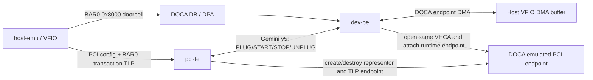
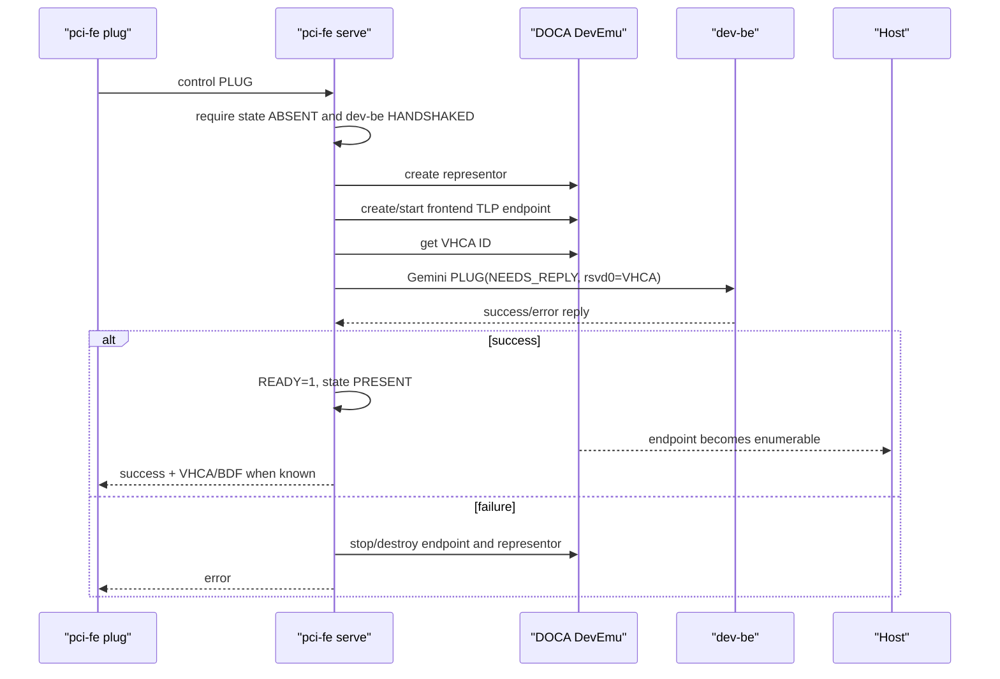

# VFIO AdminQ v1 设计

## 1. 文档状态与设计结论

本文定义 `applications/vfio_adminq` 的第一版设计。项目包含三个彼此独立的程序：

- `pci-fe`：DPU 侧 PCI 前端，负责 DOCA 设备创建/销毁、Host PCI 配置空间、BAR0
  寄存器、TLP 处理和 Gemini 服务端。
- `dev-be`：DPU 侧数据后端，负责 Gemini 客户端、DOCA doorbell/DPA 和 endpoint
  DMA。
- `host-emu`：Host 侧 VFIO 程序，负责打开设备、映射 BAR0 和 DMA 内存、
  配置 AdminQ、敲 doorbell 并验证 DMA 回写。

v1 采用以下已确认约束：

1. 不定义新 ABI，复用已验证的 SRDMA PCI ID、BAR 寄存器、Gemini v5 消息和
   `srdma_adminq_test_msg`。
2. 不实现 MSI-X；Host 轮询 DMA buffer 中的完成状态。
3. 只支持单 Host、单设备、单 AdminQ、单 outstanding command。
4. 不支持 SR-IOV、迁移/live upgrade、恢复旧 endpoint、多后端或多队列。

“对齐 io-engine 标准”在本文中表示：控制消息格式、BAR 寄存器语义、设备状态转换、
PLUG/START/STOP/UNPLUG 顺序以及 TLP completion 行为均与已验证 io-engine 链路一致。
为避免产生第二套协议，共享结构从本项目公共头文件生成，三个程序不得各自复制定义。

## 2. 设计依据

设计以以下已验证实现为基线：

- `/root/ByteDance/srdma-doca-demo/TEST.md`
- `/root/ByteDance/srdma-doca-demo/host/srdma-backend`
- `/root/ByteDance/srdma-doca-demo/instance/srdma-driver`
- `/root/ByteDance/bes3-io-engine/docs/bes2/doca-device-adapter.md`
- io-engine `hw/bes2/bf3/bf3_dev.c`、`hw/bes2/bf3/tlp.c`、
  `hw/bes2/bes2_tlp_handler.c`、`hw/bes2/srdma_bfa.c`、
  `hw/bes2/devices.c`、`hw/bes2/client.c` 和 `include/hw/bes2/message.h`

移植原则是提取所需机制，而不是把 QEMU/io-engine 整体嵌入新程序。v1 只保留单 endpoint
所需的 PCI/TLP、寄存器和消息路径。

## 3. 总体架构



对象所有权如下：

| 对象 | 唯一所有者 | 说明 |
| --- | --- | --- |
| 主 DOCA device、PCI type | `pci-fe` | type 名称固定为 `custom_pci_dev` |
| representor 的创建/销毁 | `pci-fe` | `dev-be` 只能按 VHCA ID 打开/关闭 |
| Host 可见 PCI function | `pci-fe` | 包括 PCI config、BAR0 和 reset 状态 |
| primary TLP channel | `pci-fe` | 处理 CfgRd/CfgWr/MRd/MWr/PCI reset |
| 前端 TLP endpoint handle | `pci-fe` | 用于完成对应 endpoint 的 TLP |
| 后端 representor handle | `dev-be` | 从 PLUG 的 `rsvd0` 获取 VHCA ID 后打开 |
| 后端 TLP endpoint handle | `dev-be` | 按已验证 demo 的 attach 方式创建和启动 |
| DB completion、DB、DPA、Comch | `dev-be` | `pci-fe` 不消费 DB region |
| remote mmap、DMA、local mmap | `dev-be` | 访问 Host VFIO 映射的 IOVA |
| VFIO container/group/device | `host-emu` | Host 进程退出时释放 |

两个 DPU 进程会为同一 representor 各持有一个用途不同的 TLP endpoint handle。这是当前
已验证链路的既有方式；v1 不改成跨进程共享 DOCA object，也不新增 side-channel 传递
DOCA handle。

## 4. v1 功能范围

### 4.1 必须实现

- `pci-fe` 创建 `custom_pci_dev` type、representor 和 endpoint，并支持运行时 plug/unplug。
- Host 能枚举 `1e93:006a`，通过 `driver_override` 绑定 `vfio-pci`。
- `pci-fe` 处理单设备所需的配置空间 TLP 和 BAR0 transaction TLP。
- Host 写 AdminQ 地址/深度和 `CTRL.INIT_DONE` 后，`pci-fe` 向 `dev-be` 发送 START。
- `dev-be` 收 PLUG 后按 VHCA ID attach，创建 DB/DPA/DMA 资源并回复结果。
- Host 写 BAR0 `0x8000` 后，`dev-be` 收 DB、DMA read 256 字节、更新消息并 DMA write。
- `host-emu` 轮询 `status == SRDMA_ADMINQ_TEST_HOST_DONE`，验证序号和内容。
- STOP、UNPLUG、进程退出和失败路径按依赖反序清理，重复请求保持幂等。

### 4.2 明确不实现

- MSI/MSI-X 及 eventfd completion。
- 多 endpoint、PF/VF、SR-IOV、多个 Gemini SRDMA client。
- 多 AdminQ、ring、并行 DMA 或乱序完成。
- SRDMA 数据面、QP、RXQ、AEQ 业务语义；这些字段仅为保持现有 START ABI。
- live upgrade、migration、持久化 endpoint、stale endpoint 自动接管。
- io-engine 的 QMP、QOM、BQL、共享内存、QoS、诊断和 virtio-net peer 依赖。
- Host kernel 功能驱动；Host 只使用 `vfio-pci`。

## 5. 兼容 ABI

### 5.1 PCI identity

| 字段 | v1 值 |
| --- | ---: |
| Vendor ID | `0x1e93` |
| Device ID | `0x006a` |
| Revision | `0` |
| Class code | `0x020000`（Ethernet controller） |
| Header type | Type 0 endpoint |
| BAR0 | 64-bit memory BAR |

不声明 MSI-X capability。`SRDMA_BFA_PCI_MAX_VECTORS` 返回 `0`。PCI Express capability
只保留 Host 枚举/FLR 确实需要的最小字段；第一阶段若基本枚举无需该 capability，则不暴露。

### 5.2 DOCA type 与 BAR0 layout

沿用已验证参数：

| 项目 | 值 |
| --- | ---: |
| DOCA PCI type 名称 | `custom_pci_dev` |
| DOCA BAR0 `log_size` | `20`（1 MiB） |
| Host PCI config 报告的 BAR0 size | `0x10000`（64 KiB） |
| transaction region | BAR0 `0x0000..0x7fff` |
| doorbell region | BAR0 `0x8000..0x8fff` |
| DB `log_db_size` | `1` |
| DB `log_stride` | `3` |
| 使用的 DB ID | `0` |
| 使用的 DB offset | `0x8000` |

DOCA type 的 1 MiB 与 Host-visible 64 KiB 是现有验证环境中的兼容性事实。v1 原样保留，
不在本项目中单方面改成新 layout。`0x9000..0xffff` 对 Host 保留，超过 Host-visible
64 KiB 的 type 空间不允许 `host-emu` 访问。

### 5.3 BAR0 寄存器

寄存器均为 little-endian，沿用 `srdma_bfa.h`：

| Offset | 名称 | 访问 | v1 语义 |
| ---: | --- | --- | --- |
| `0x00` | VERSION | RO | 返回 `1` |
| `0x04` | READY | RO | PLUG 完成且 `dev-be` 回复成功后为 `1` |
| `0x08` | MAX_QP_NUM | RO | 保持兼容，返回 `128`，v1 不使用 |
| `0x0c` | MAX_VECTORS | RO | 返回 `0` |
| `0x10` | MACADDR | RO | 返回配置的 6 字节 MAC，默认与测试脚本一致 |
| `0x20` | CTRL | WO | bit0 RESET，bit1 INIT_DONE |
| `0x24` | STATUS | RO | bit1 表示 START 已成功 |
| `0x40/0x44` | ADMIN_TXQ_ADDR lo/hi | RW | `host-emu` 的测试消息 IOVA |
| `0x48/0x4c` | ADMIN_RXQ_ADDR lo/hi | RW | 保留并随 START 发送 |
| `0x50/0x54` | ASYNCQ_ADDR lo/hi | RW | 保留并随 START 发送 |
| `0x58` | ADMINQ_DEPTH | RW | 默认 `16` |
| `0x5c` | ASYNCQ_DEPTH | RW | 默认 `16` |
| `0x80..0xbf` | DIAG | RO | v1 返回 0 |
| `0x8000` | ADMINQ DB | WO/DOCA DB | DB ID 0，value 为 guest sequence |

寄存器访问允许现有 io-engine 的 1/2/4/8 字节、非对齐 TLP 语义，但状态变化只在完整覆盖
目标字段时发生。64-bit queue address 继续支持低 32 位和高 32 位分开写。

`CTRL.INIT_DONE` 的处理规则：

1. 校验 `READY == 1`、bus master 已开启、TX/RX/AEQ IOVA 非 0、depth 非 0。
2. 构造并发送 SRDMA START，等待 `dev-be` 回复，超时 10 秒。
3. 只有成功回复后才置 `STATUS.INIT_DONE`。
4. 失败时保持 STATUS 清零，保存可诊断错误并允许 Host 重试。

`CTRL.RESET`、FLR、bus master clear 和 unplug 都进入同一 STOP 路径。STOP 成功或超时后
清空 STATUS；queue 地址可以保留到下一次 Host 重写，但 `dev-be` 必须清除 `adminq_ready`。

### 5.4 Gemini v5 wire format

默认 Unix socket 为 `/var/tmp/bes2/bes2-server.sock`。保持 16 字节消息头：

```c
struct gemini_msg_hdr {
    uint32_t request;
    uint32_t request_id;
    uint32_t flags;
    union {
        uint32_t data_len;
        uint32_t errcode;
    };
} __attribute__((packed));
```

v1 使用的值：

- protocol version：`5`，存于 `flags[7:0]`。
- `GEMINI_HELLO = 0`，client type 为 `GEMINI_MSG_TYPE_SRDMA = 4`。
- `GEMINI_CONFIG_UPDATE = 3`。
- `NEEDS_REPLY/HAS_ERROR = bit30`，`IS_REPLY = bit31`。
- config subtype 位于 `flags[15:8]`。
- PLUG=`0x00`、UNPLUG=`0x01`、START=`0x06`、STOP=`0x07`。

所有 CONFIG_UPDATE 均设置 NEEDS_REPLY，超时为 10 秒。reply 必须回显 request、request_id，
并设置 IS_REPLY；失败同时设置 HAS_ERROR 和现有 Gemini errcode。`pci-fe` 同一时刻只允许
一个等待 reply 的请求，因此无需实现多请求重排。

PLUG payload 原样使用 128 字节 `GeminiSRDMAPlugMsg`。关键兼容约定是：

- `rvf_id = 0`。
- `doorbell_pages`、`max_qp_num` 保持 io-engine 字段语义。
- `rsvd0[0:1]` 以 little-endian 保存 endpoint VHCA ID。
- 其余 peer netdev、MSI-X bitmap 字段保留现有位置；本项目无对应资源时填 0。

虽然 `rsvd0` 从命名上是保留字段，但这是已验证实现当前使用的接口。v1 必须保持，不新增
替代字段。

START payload 原样使用 116 字节 `GeminiSRDMAStartMsg`，包含 `rvf_id`、`pcie_port`、
`bdf`、TX/RX/AEQ IOVA 和三个 depth。`dev-be` v1 只使用 TX IOVA/depth，但必须严格校验
payload 总长度并完整记录其余字段用于诊断。

STOP 和 UNPLUG payload 均为 2 字节 little-endian `vdev_id`，v1 固定为 0。

### 5.5 AdminQ DMA buffer

不新增 command/rsp ABI，继续使用已验证的 packed 256 字节结构：

```c
struct srdma_adminq_test_msg {
    uint32_t magic;                 /* 0x51445253 */
    uint16_t version;               /* 1 */
    uint16_t status;
    uint32_t guest_seq;
    uint32_t host_seq;
    uint64_t guest_iova;
    uint64_t host_seen_doorbells;
    char guest_text[64];
    char host_text[64];
    uint8_t reserved[96];
} __attribute__((packed));
```

状态值保持 `EMPTY=0`、`GUEST_READY=1`、`HOST_DONE=2`。本结构是 v1 唯一 AdminQ 命令，
不定义 opcode、ring head/tail 或 response queue。

## 6. `pci-fe` 设计

### 6.1 进程接口

同一二进制提供三个子命令：

```text
pci-fe serve [--pci-addr 0000:03:00.0]
             [--gemini-socket /var/tmp/bes2/bes2-server.sock]
             [--control-socket /run/vfio-adminq/pci-fe.sock]

pci-fe plug [--control-socket ...]
pci-fe unplug [--control-socket ...]
```

`serve` 是唯一长期进程并持有 singleton lock。`plug/unplug` 只是向 control socket 发送
本地管理命令，不直接打开 DOCA 对象，因此项目仍只有三个程序。

### 6.2 内部模块

建议文件划分：

```text
pci-fe/
  main.c                 参数、signal、serve/plug/unplug
  pci_fe.c/.h            生命周期状态机和对象所有权
  pci_type.c/.h          DOCA device/type/representor/endpoint
  pci_config.c/.h        单 endpoint PCI config space 和 BAR probe/mapping
  bar0.c/.h              SRDMA BAR0 寄存器模型
  tlp_channel.c/.h       DOCA primary TLP channel adapter
  tlp_dispatch.c/.h      CfgRd/CfgWr/MRd/MWr parser/completion
  gemini_server.c/.h     Gemini HELLO、request/reply、client 状态
  control.c/.h           本地 plug/unplug socket
```

### 6.3 启动流程

1. 创建运行目录、锁文件、Gemini socket 和 control socket。
2. 打开 `--pci-addr` 指定且支持 PCI TLP 的 DOCA device。
3. 创建 `custom_pci_dev`，设置 BAR0、transaction region、DB region并启动 type。
4. 创建 primary TLP channel、PE，设置 non-posted timeout，注册 TLP/PCI event callback。
5. 初始化单 endpoint 的 PCI config template 和 BAR0 寄存器为 RESET 状态。
6. 等待 `dev-be` HELLO 和管理端 `plug` 命令；启动本身不自动插入设备。

任一步失败均按反序销毁。启动时发现同名残留 representor时返回明确错误；v1 不自动删除
无法证明归属的设备。

### 6.4 Plug 流程



PLUG 的成功条件不是“representor 已创建”，而是 `dev-be` 已创建 DB/DMA 所需设备级资源。
在回复成功前 Host 即使发来 endpoint config TLP，`pci-fe` 也返回 CRS 或保持 device not
present，不能提前暴露 READY。

### 6.5 最小 PCI config/TLP 模型

`pci-fe` 不依赖 QEMU。它维护一个 256 字节 Type 0 config image 和少量写掩码/副作用：

- Vendor/device/revision/class/header type。
- COMMAND 的 Memory Space Enable 和 Bus Master Enable。
- STATUS/capability pointer（仅在实际声明 capability 时有效）。
- 64-bit BAR0 low/high，支持写全 1的 size probe、两阶段地址写入和 64 KiB mask。
- 可选最小 PCIe capability/FLR；若暴露 FLR bit，必须完整处理其 reset 副作用。

单 Host/单 endpoint 仍需要保留 io-engine TLP handler 中用于 Host 枚举的最小 upstream /
downstream bridge 路由。实现时从 `bes2_tlp_handler.c` 提取 Cfg0/Cfg1 路由、BDF 匹配和
completion 构造；可参考仓库 `vnet_pci_dev/pci_spec_tlp.*` 的独立模型，但 Host-visible
字段必须取 io-engine SRDMA 值。

v1 接受的 TLP：

| TLP | 处理 |
| --- | --- |
| CfgRd0/CfgRd1 | 路由已知 bridge/endpoint，返回 completion with data |
| CfgWr0/CfgWr1 | 应用 byte enable 和写掩码，返回无数据 completion |
| MRd 3DW/4DW | 检查 MSE、BAR0 命中和长度，返回寄存器数据 |
| MWr 3DW/4DW | 检查 MSE、BAR0 命中和 byte enable，执行寄存器写；posted 无 completion |
| 其他 TLP | 非 posted 返回 UR；posted 记录并丢弃 |
| PERST assert/deassert | 执行设备 reset，完成 PCI event request |

TLP header 从 DOCA buffer 取出时逐 dword `be32toh`，completion header 写回时逐 dword
`htobe32`。数据 byte enable、length=0 表示 1024 DW、4 KiB 边界和地址溢出必须在访问前
校验。v1 同一时刻只处理一个 pending TLP；callback 只保存 request，主循环完成解析和
`doca_devemu_pci_tlp_channel_req_complete_*()`。

BAR0 地址命中条件为：MSE 开启、BAR0 已分配且请求范围完整落在 Host-visible 64 KiB。
`0x0000..0x7fff` 进入 `bar0.c`，`0x8000..0x8fff` 正常由 DOCA DB region 截获；若调试
环境仍将该写送至 TLP，前端只记录，不代替 `dev-be` 处理业务。

### 6.6 START/STOP 与寄存器状态

START 从 TLP 主循环投递到 Gemini worker，不能在 DOCA callback 中同步等待。等待 reply
期间继续 progress TLP channel，但对同一设备的第二个 INIT_DONE 返回 busy/保持未完成。

状态机：

```text
ABSENT
  plug + PLUG reply success -> PRESENT_STOPPED

PRESENT_STOPPED
  valid CTRL.INIT_DONE -> STARTING
  unplug -> UNPLUGGING

STARTING
  START reply success -> STARTED (STATUS.INIT_DONE=1)
  START error/timeout -> PRESENT_STOPPED
  reset/unplug -> defer STOP after START resolves or timeout

STARTED
  RESET / FLR / BME clear -> STOPPING
  unplug -> STOPPING then UNPLUGGING

STOPPING
  STOP reply/error/timeout -> PRESENT_STOPPED (STATUS=0)

UNPLUGGING
  UNPLUG reply or timeout -> destroy endpoint/rep -> ABSENT
```

PLUG 失败必须回滚 Host-visible device。START 失败不拔设备，允许 Host reset 后重试。
UNPLUG 即使 `dev-be` 失联，也在 10 秒超时后继续前端清理并打印 forced cleanup。

## 7. `dev-be` 设计

### 7.1 移植范围

以已验证 `host/srdma-backend` 为基础保留：

- Gemini socket connect、HELLO、消息 framing 和 reply。
- 从 PLUG `rsvd0` 读取 little-endian VHCA ID。
- 创建同名 `custom_pci_dev` type、打开对应 representor、创建/启动后端 TLP endpoint。
- endpoint remote mmap、local mmap、DOCA DMA、buf inventory。
- DPA DB completion、DB object、Comch MsgQ 和 Host/DPA 通知路径。
- START 设置 TX IOVA/depth，STOP 清除，UNPLUG 反序清理。
- 256 字节 DMA read/update/write 测试路径。

删除 SRDMA 业务无关配置、MSI-X、多个 DB 和多队列逻辑。

### 7.2 生命周期

`dev-be` 可在 `pci-fe plug` 之前启动。它先连接 Gemini 并发送 HELLO，然后等待 PLUG：

1. 严格检查 request、flags、version=5 和 payload 长度=128。
2. 从 `rsvd0` 解析 VHCA ID。
3. 打开 TLP-capable DOCA device。
4. 创建并以相同参数启动 `custom_pci_dev` type。
5. 枚举 representor，按 VHCA ID 精确匹配并打开。
6. 创建/启动后端 TLP endpoint，设置 endpoint DB 数量。
7. 创建 remote/local mmap、DMA、DPA、Comch、DB completion 和 DB ID 0。
8. 全部成功后回复 PLUG success；任一步失败反序清理并回复 request failed。

START 只在 ATTACHED 状态接受。校验 TX IOVA 非 0、TX depth 非 0，并记录完整 START
payload；成功后设置 `adminq_ready=true` 再回复。重复且参数相同的 START 返回成功；参数
不同则先清除旧 queue 状态后重新 arm。

STOP 清除 `adminq_ready`，等待当前 DMA 完成或 10 秒超时。重复 STOP 返回成功。

UNPLUG 隐含 STOP，依次销毁 DB、DPA/Comch、DMA mmap/context、后端 TLP endpoint、
representor handle、type 和 DOCA device。重复 UNPLUG 在资源已释放时仍回复成功。

### 7.3 DB/DMA 路径

```text
DPA receives DB0
  -> send {type=HOST_DB, db_id=0, db_value} through Comch
  -> host callback validates adminq_ready and no command in flight
  -> DMA read 256 bytes from adminq_tx_iova to local buffer
  -> validate magic/version/status=GUEST_READY/guest_iova
  -> set status=HOST_DONE
  -> host_seq++
  -> host_seen_doorbells++
  -> fill host_text
  -> DMA write all 256 bytes to the same IOVA
  -> wait for DMA write completion
  -> return to RUNNING
```

v1 只允许一个 DMA 操作链在途。BUSY 时到达的新 DB 不覆盖当前命令；记录一次错误并丢弃。
Host 必须等待前一条完成后再提交。首次启动 DB object 可能产生 value=0 的 completion，保持
已验证实现的 `drop_initial_db_completion` 逻辑。

所有 IOVA 运算先检查溢出。remote mmap 虽保持已验证 demo 的 endpoint 全 IOVA 范围，
实际 DMA 长度固定为 256，且只使用 START 下发的 TX IOVA。

## 8. `host-emu` 设计

### 8.1 命令行

```text
host-emu --bdf <domain:bus:device.function>
         [--size 4096]
         [--iova 0x100000000]
         [--timeout-sec 10]
         [--doorbell-value 1]
```

绑定设备继续由独立 helper `bind-vfio.sh <BDF>` 完成。helper 沿用现有
`bind-srdma-vfio.sh`：加载 `vfio-pci`、设置 `driver_override`、解绑原驱动并绑定 VFIO。

### 8.2 执行流程

1. 从 sysfs 解析 IOMMU group。
2. 打开 `/dev/vfio/vfio`、group 和 device fd，检查 API、group viable、PCI device。
3. 设置 `VFIO_TYPE1_IOMMU`，通过 PCI config region 打开 MSE 和 BME。
4. 匿名映射 page-aligned DMA buffer，并以固定 IOVA 调用 `VFIO_IOMMU_MAP_DMA`。
5. mmap BAR0，检查 region 支持 mmap 且至少覆盖 `0x8004`。
6. 写 TX/RX/AEQ IOVA、depth，再写 `CTRL.INIT_DONE`。
7. 轮询 `STATUS.INIT_DONE`，最长 30 秒。
8. 在 TX IOVA 写 256 字节 `srdma_adminq_test_msg`，执行 store barrier。
9. 向 BAR0 `0x8000` 写 sequence，执行 MMIO/store barrier。
10. 轮询 DMA buffer，直到 HOST_DONE 或 10 秒超时；校验 magic/version/guest_seq、
    `host_seq != 0` 和 `host_seen_doorbells != 0`。
11. 写 `CTRL.RESET`，再 unmap BAR、VFIO DMA 和关闭 fd。
12. 最终 UNPLUG 前由 `unbind-vfio.sh <BDF>` 在 Host 先解绑驱动并写 sysfs `remove`；
    Host function 消失后，才允许 `pci-fe unplug` 销毁 DPU endpoint。

无 MSI-X，因此不调用 `VFIO_DEVICE_GET_IRQ_INFO`、eventfd 或 `VFIO_DEVICE_SET_IRQS`。
超时不能证明命令未执行；测试只提交一次，超时后先 reset 再解除 DMA mapping。
禁止在 Host PCI function 尚存时先销毁 DPU endpoint，否则后续配置访问可能触发 Root
Port ACS violation/DPC，并连带隔离 BlueField PF。

## 9. 线程与并发模型

### 9.1 `pci-fe`

- 一个 owner/main thread 持有全部设备状态并 progress DOCA TLP PE。
- 一个 Gemini socket thread 或非阻塞 socket handler，仅负责 framing；状态变更投递到 owner。
- control socket 同样投递事件，不直接操作 DOCA object。
- 所有有 reply 的 Gemini request 串行化。

### 9.2 `dev-be`

- 主线程轮询 Gemini fd 和 Host-side DOCA PE。
- DPA thread 只消费 DB completion，并通过 Comch 发送固定消息。
- DMA completion 在 DMA PE 上推进；单 outstanding 保证无需锁保护 queue state。
- signal handler 只设置 stop flag，不调用 DOCA API。

### 9.3 `host-emu`

- 单线程同步测试。
- signal 只设置 stop flag，正常清理路径负责 reset/unmap/close。

## 10. 错误处理与清理顺序

所有 DOCA 创建函数设置对应 `created/started` 标志；cleanup 检查标志并允许部分初始化。

`pci-fe` endpoint 清理顺序：

```text
mark not ready
STOP backend if started
UNPLUG backend
stop/destroy frontend TLP endpoint
destroy representor
reset PCI/BAR model
```

`dev-be` 清理顺序沿用已验证 backend：

```text
disarm AdminQ
stop/destroy DB and unbind DPA handle
stop/destroy Comch producer/consumer/msgq/completions
stop/destroy DPA thread/context
destroy buf inventory and local/remote mmap
stop/destroy DMA context/PE and close DMA device
stop/destroy backend TLP endpoint
close representor
stop/destroy PCI type
close DOCA device
```

错误日志必须包含阶段、DOCA error name、VHCA ID、rvf_id 和当前状态。不得在错误路径仅记录
日志后继续报告成功。

## 11. 建议目录与构建

```text
applications/vfio_adminq/
  DESIGN.md
  meson.build
  meson_options.txt              # 如顶层构建需要
  common/
    vfio_adminq_abi.h            # PCI/BAR/Gemini/AdminQ 唯一定义
    gemini_io.c/.h               # 16-byte framing/read_full/write_full
    tlp_spec.h
  pci-fe/
    ...
  dev-be/
    ...
    dpa/doorbell_dev.c
    dpa/attributes.yaml
  host-emu/
    host_emu.c
    bind-vfio.sh
```

建议产物名：

- `doca_vfio_adminq_pci_fe`
- `doca_vfio_adminq_dev_be`
- `vfio_adminq_host_emu`

公共头使用 `_Static_assert` 固定：Gemini header 16 字节、PLUG 128 字节、START 116 字节、
AdminQ test message 256 字节。构建时禁止隐式 padding 改变 wire layout。

## 12. 实现阶段

### 阶段 A：公共 ABI 与 Host 程序

- 提取共享寄存器/Gemini/AdminQ 头。
- 将已验证 `srdma-driver` 改名并最小清理为 `host-emu`。
- 添加结构大小、BAR offset 和 VFIO 参数单元测试。

### 阶段 B：`dev-be`

- 原样移植已验证 Gemini client、PLUG attach、DPA DB 和 DMA 路径。
- 删除 SRDMA 业务字段的行为依赖，但保持 wire 字段。
- 用 mock socket 测 HELLO/PLUG/START/STOP/UNPLUG framing 和错误 reply。

### 阶段 C：`pci-fe` 基础 PCI/TLP

- 提取 DOCA type、representor、TLP channel。
- 实现单 endpoint config space、BAR probe/relocation、Cfg/Mem TLP completion。
- 先用 Host `lspci` 和 VFIO BAR read/write 验证，不接 `dev-be` 数据面。

### 阶段 D：Gemini 与完整生命周期

- 实现 Gemini server 和本地 plug/unplug control。
- 接通 BAR INIT_DONE -> START、reset -> STOP、unplug -> UNPLUG。
- 完成端到端 DB/DMA 测试和失败注入。

## 13. 验收标准

正常链路必须出现以下可核对结果：

1. `dev-be` HELLO 成功并等待 PLUG。
2. `pci-fe plug` 创建 endpoint，PLUG 携带正确 VHCA，`dev-be` 初始化成功。
3. Host `lspci -Dnn` 显示 `1e93:006a`，设备可绑定 `vfio-pci`。
4. `host-emu` 打开 VFIO、映射 DMA/BAR0并触发 INIT_DONE。
5. `pci-fe` 收到 BAR 写，START 成功后 STATUS bit1 置位。
6. Host 写 `0x8000` 后 `dev-be` 只收到一次有效 DB。
7. `dev-be` 从 TX IOVA DMA read，写入 HOST_DONE 后 DMA write。
8. `host-emu` 在超时前验证 HOST_DONE、host_seq 和 doorbell 计数。
9. Host reset 触发 STOP；再次 INIT_DONE 可重新 START 并再执行一次测试。
10. `pci-fe unplug` 后 Host 设备消失，两个 DPU 进程无残留 rep/endpoint/DB/DMA 对象。

还必须覆盖失败注入：无 `dev-be` 时拒绝 plug、PLUG 中途失败回滚、START payload 非法、
Gemini reply 超时、重复 STOP/UNPLUG、DMA read/write 失败、`dev-be` 在 STARTED 状态退出、
Host 在 BUSY 时 reset。

## 14. 已知兼容性债务

- VHCA ID 使用 `GeminiSRDMAPlugMsg.rsvd0`，字段名与实际用途不一致；为兼容已验证链路保留。
- DOCA type BAR0 为 1 MiB，而 Host-visible BAR0 为 64 KiB；v1 不改变。
- PLUG/START payload 带有大量 SRDMA/netdev/MSI-X 保留字段，本项目仍需按原大小传输。
- `srdma_adminq_test_msg` 只是一次一命令的验证结构，不是通用生产 AdminQ。
- 无 MSI-X 时 Host 只能轮询；这是 v1 明确边界，不通过新增 BAR 状态或新消息补偿。

上述问题只能在后续明确升级 ABI 时统一解决，不允许在 v1 实现过程中静默修改。

## 15. 代码移植映射

| 新模块 | 主要来源 | v1 处理 |
| --- | --- | --- |
| `pci-fe/pci_type.c` | io-engine `hw/bes2/bf3/bf3_dev.c` | 保留 custom type、BAR region、rep、frontend TLP endpoint；删除 vnet/vblk、pool 和 live upgrade |
| `pci-fe/tlp_channel.c` | io-engine `hw/bes2/bf3/tlp.c` | 保留 primary channel、PE、callback、completion；删除 LU、ACG 优化和多 Host |
| `pci-fe/tlp_dispatch.c` | io-engine `hw/bes2/bes2_tlp_handler.c` | 只保留单 topology 的 Cfg/Mem 请求、byte enable 和 completion |
| `pci-fe/pci_config.c` | io-engine PCI/QEMU config 行为及 `applications/vnet_pci_dev/pci_spec_tlp.*` | 用独立 256 字节模型代替 QEMU object model |
| `pci-fe/bar0.c` | io-engine `hw/bes2/srdma_bfa.c/.h` | 保留寄存器、START/STOP 触发；删除 SR-IOV、MSI-X、迁移和 netdev peer |
| `pci-fe/gemini_server.c` | io-engine `hw/bes2/server.c`、`client.c`、`message.h` | 只实现单 SRDMA client、HELLO、四种 CONFIG_UPDATE 和 reply timeout |
| `dev-be/gemini_client.c` | 已验证 demo `host/gemini_client.c` | 原样保持 framing、payload 和状态语义 |
| `dev-be/backend.c` | 已验证 demo `host/srdma_backend.c` 及 DPA doorbell 文件 | 保留 PLUG attach、DB/DPA/DMA；删除未使用扩展 |
| `host-emu/host_emu.c` | 已验证 demo `instance/srdma-driver.c` | 保留 VFIO、BAR、DMA、DB 和轮询；重命名 SRDMA 日志但不改 ABI |
| `common/vfio_adminq_abi.h` | demo `common/srdma_adminq_test.h` 与 io-engine `message.h`/`srdma_bfa.h` | 集中定义并添加结构大小断言，不改变字段 |
