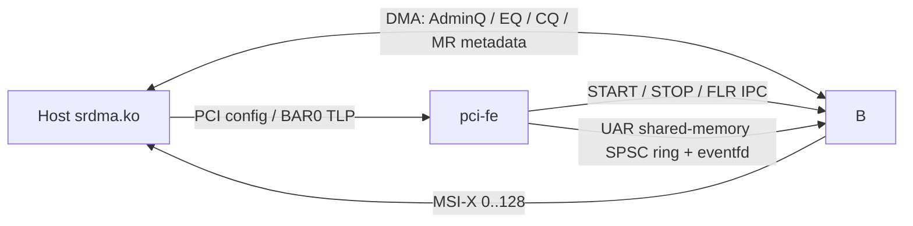
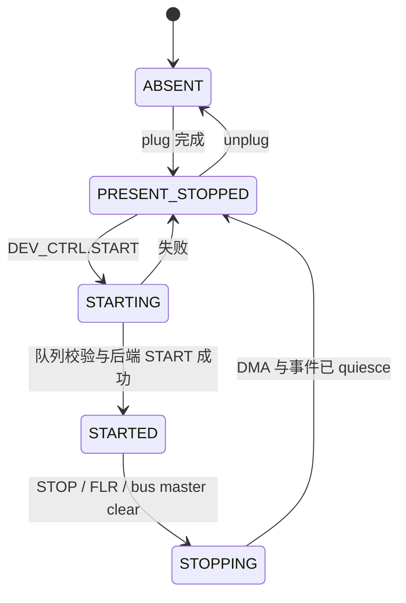

# VFIO AdminQ 对接 sRDMA 内核驱动设计

## 1. 文档状态

本文定义 `applications/vfio_adminq` 从最小 VFIO AdminQ 闭环升级为可被
`srdma.ko` 驱动使用的设备模拟方案。

- Host 驱动基线：`/root/ByteDance/srdma/host/kernel` commit `a00bd15d`，并增加
  本文定义的单 BAR fallback。
- 驱动 ABI 基线：`/root/ByteDance/srdma/host/kernel/ADMINQ_ABI.md`。
- DOCA 基线：3.4.0302，BF3 emulation manager `0000:03:00.0`。
- PCI ID：`1e93:006a`。
- 本文是 v2 目标设计；现有 [BASIC_DESIGN.md](BASIC_DESIGN.md) 继续记录 v1
  最小测试闭环。
- v2 实现范围固定为阶段 A-C 及其可靠性验证，只实现 PCIe、AdminQ 和 verbs
  资源控制面；RoCE RC 数据面不在本项目范围内。

本文只固化已经从驱动源码、实测 ABI 或 DOCA capability 得到确认的接口。
DOCA object 组合以 2026-07-24 的 BF3 实机验证结果为准。

## 2. 结论与设计决策

v2 采用以下确定方案：

1. 受 DOCA 3.4 实机能力限制，设备只暴露一块 256 KiB 64-bit BAR0。CFG、MSI-X
   table/PBA 和 UAR 共用 BAR0；`srdma.ko` 增加单 BAR fallback，并保留现有
   BAR0/BAR2 与 legacy BAR2/BAR4 兼容路径。
2. UAR 从 BAR0 `0x10000` 开始，共 48 个 4 KiB page，恰好由三个 64 KiB
   transaction region 覆盖。
3. 暴露 129 个 MSI-X vector：vector 0 为 AdminQ/AEQ control vector，vector
   1..128 为 CEQ completion vector。
4. 删除 v1 的 256 B 测试消息语义，改为真实的双 128-depth AdminQ DMA ring。
5. 使用 TLP-only 方案：BAR0 CFG 占用 1 个 transaction region，BAR0 UAR 的
   32-bit 和 64-bit doorbell 由其余 3 个 transaction region 处理；不使用
   stateful region，也不依赖只能保存最多 32-bit value 的 DOCA DB object。
6. 首版保持单 endpoint，但必须支持多 AdminQ outstanding、多个 PD/MR/EQ/CQ/QP
   和异步 MSI-X completion。
7. 本项目只实现控制面，不实现 SQ/RQ transport、RoCE packet、RC retry 或
   RDMA send/read/write 数据面，也不引入 `srdma_engine`。

### 2.1 DOCA capability 依据

本机只读 capability probe 的结果如下：

| 项目 | 实测值 | v2 使用值 |
| --- | ---: | ---: |
| 可配置 BAR 数 | 2 | 1 |
| BAR 最小/最大 `log2(size)` | 12 / 30 | BAR0=18 |
| MSI-X 最大数 | 256 | 129 |
| DB 最大数 | 256 | 首版不作为 64-bit UAR 主路径 |
| 单 DB 最大宽度 | 4 B | UAR 有 8 B write，不能直接使用 |
| MSI-X table region | 1 × 4 KiB | 1 × 4 KiB |
| MSI-X PBA region | 1 × 4 KiB | 1 × 4 KiB |
| 单 transaction region 最大值 | 64 KiB | 64 KiB |
| transaction region 总数 | 4 | BAR0 CFG 使用 1 个，UAR 使用 3 个 |
| stateful region | 1 × 256 B | 不使用；与 TLP type 组合被 SDK 拒绝 |

额外 type probe 表明，当前 SDK 只有“BAR0 64-bit + BAR1 disabled”能稳定启动；
同时启用 BAR0 与 BAR2 会在 type start 阶段失败。因此 v2 固定使用单 BAR，
Host-visible BIR 为 0。

## 3. 总体架构



### 3.1 组件职责

`pci-fe` 负责：

- PCI type、representor、endpoint 和 Host-visible config space。
- BAR0 CFG 和 UAR transaction TLP 的解析与 completion。
- START/STOP/FLR/bus-master-clear 状态机。
- 把 START/STOP/FLR 等生命周期事件以及完整的 32/64-bit UAR write 可靠传给
  `dev-be`。

`dev-be` 负责：

- 消费 `pci-fe` 发布的 UAR event ring。
- Host IOVA remote mmap、异步 DOCA DMA 和 staging buffer pool。
- AdminQ TX 消费、RX completion 生产和 owner 管理。
- UCTX、PD、MR、EQ、CQ、QP、GID、统计和健康状态。
- AEQ 写入和 control MSI-X raise；创建并跟踪 CEQ/CQ，但不生成数据 CQE。

`host-emu` 在 v2 中只作为 PCI/DMA 故障注入与 ABI 单测工具，不再代表真实 Host
功能路径。主要验收对象改为 `srdma.ko`、RDMA core、`ibv_devinfo` 和
`host-ctrl-test` 控制面测试。

## 4. PCI 与 BAR 设计

### 4.1 PCI identity 和能力

| 字段 | 值 |
| --- | ---: |
| Vendor ID | `0x1e93` |
| Device ID | `0x006a` |
| Revision | `0`，后续 ABI 变更才递增 |
| Class | `0x020000` |
| Header type | Type 0 endpoint |
| DMA mask | 64 bit |
| MSI-X vectors | 129 |

PCI config space 至少提供：

- 一块 256 KiB 64-bit non-prefetchable BAR0。
- PCI Express endpoint capability 和 FLR。
- MSI-X capability，table BIR 指向 BAR0 `0x1000`，PBA BIR 指向 BAR0
  `0x2000`，table size 字段为 128，即 129 vectors。
- 正确的 command register Memory Space 和 Bus Master 语义。

### 4.2 BAR0：256 KiB

```text
BAR0 0x00000..0x3ffff

0x00000..0x00fff  CFG window，驱动仅映射这一页
0x01000..0x01fff  DOCA MSI-X table region
0x02000..0x02fff  DOCA MSI-X PBA region
0x03000..0x0ffff  reserved，读 0、写忽略
0x10000..0x3ffff  48 个 UAR page
```

BAR0 `0x0000..0x0fff` 配置为一个 transaction region，由 `pci-fe` 处理 Host
MMIO read/write TLP，并在设备状态变化时返回动态值。BAR0 CFG 寄存器：

| Offset | 名称 | 访问 | v2 语义 |
| ---: | --- | --- | --- |
| `0x00` | DEV_VER | R | `1` |
| `0x04` | DEV_READY | R | 后端和中断资源就绪后为 `1` |
| `0x0c` | MAX_VECTORS | R | `129` |
| `0x10` | NDEV_ADDR | R64 | 与 Host 关联网卡 permanent MAC 完全一致 |
| `0x20` | DEV_CTRL | W32 | bit0 STOP，bit1 START |
| `0x24` | DEV_STA | R32 | `0` STOPPED，`2` STARTED |
| `0x40/44` | ADMINQ_TX_LO/HI | W32 | Admin TX IOVA |
| `0x48/4c` | ADMINQ_RX_LO/HI | W32 | Admin RX IOVA |
| `0x50/54` | AEQ_LO/HI | W32 | AEQ v1 IOVA |
| `0x58` | ADMINQ_DEPTH | W32 | 必须为 128 |
| `0x5c` | AEQ_DEPTH | W32 | 必须为 4096 |
| `0x80` | HEALTH_L | R64 | heartbeat 和 FW version |
| `0x88` | HEALTH_H | R64 | HW version 和 alive 状态 |

`NDEV_ADDR` 必须由命令行或 endpoint 配置传入，不再使用 v1 固定测试 MAC。
找不到相同 permanent MAC 的 Host netdev 时，驱动会延迟 probe。

### 4.3 BAR0 UAR window

BAR0 的 `0x10000..0x3ffff` 包含 48 个 UAR page：

```text
UAR address = BAR0 base + 0x10000 + (uctx_id << 12)
uctx_id 0      kernel reserved page
uctx_id 1..47  可分配的 user context page
uctx_id >= 48  ALLOC_UCTX 返回 NO_RESOURCE
```

每页 doorbell layout：

| Page offset | 宽度 | 含义 |
| ---: | ---: | --- |
| `0x000` | 32 | AdminQ producer index `[15:0]` |
| `0x004` | 32 | AEQ consumer index `[15:0]` |
| `0x040` | 64 | CEQ CI `[31:16]`、EQ handle `[40:32]` |
| `0x080` | 64 | CQ number、arm CI、solicited、command sequence |
| `0x0c0` | - | RQ MMIO 预留；当前驱动只更新 DMA DB record |
| `0x100` | 64 | SQ PI `[31:16]`、QPN `[63:40]` |

DOCA 单个 DB value 最大 4 B，而 CEQ/CQ/SQ doorbell 是 8 B。首版不允许把
这些 8 B write 截断为一个 DOCA DB completion，必须保留完整 TLP payload。

### 4.4 Transaction region 预算

DOCA 当前最多允许 1 个 256 B stateful region，以及 4 个 transaction region、
每个最大 64 KiB。实测确认 stateful region 不能配置到 TLP type，因此 v2 的 4 个
transaction region 分配为：

| Region | BAR | 范围 | 用途 |
| --- | ---: | --- | --- |
| transaction 0 | BAR0 | `0x0000..0x0fff` | CFG registers |
| transaction 1 | BAR0 | `0x10000..0x1ffff` | UAR page 0..15 |
| transaction 2 | BAR0 | `0x20000..0x2ffff` | UAR page 16..31 |
| transaction 3 | BAR0 | `0x30000..0x3ffff` | UAR page 32..47 |

`ALLOC_UCTX` 只允许 id 1..47；更大的 id 稳定返回 `NO_RESOURCE`。后端不得为未覆盖
page 创建 context。

### 4.5 Mixed-type 实机验证结论

2026-07-24 在 BF3 emulation manager `0000:03:00.0`、DOCA 3.4.0302 上以 root
运行最小探针。探针只打开 DOCA device，创建未启动的临时 type 并在配置后立即销毁；
未创建 representor 或 endpoint，未对 Host 热插拔。结果为：

```text
tlp_type + stateful_region: 2 (Operation not permitted)
generic_type + transaction_region: 2 (Operation not permitted)
```

第一条路径用 `doca_devemu_pci_tlp_type_create()` 创建 TLP type，再调用
`doca_devemu_pci_type_set_bar_stateful_region_conf()`；第二条路径用
`doca_devemu_pci_type_create()` 创建 generic type，再调用
`doca_devemu_pci_tlp_type_set_bar_transaction_region_conf()`。两条路径都在 type
配置阶段返回 `DOCA_ERROR_NOT_PERMITTED`，早于 representor 和 endpoint handle 创建。
因此不存在一个能同时声明 BAR0 stateful region 与另一 transaction region 的 type，
也就无法在其同一 representor 上建立所需的 `pci_dev`/`tlp_dev` 混合方案。v2 固定采用
上述 TLP-only 布局，不再把 mixed-handle 作为运行时探测或回退分支。随后对 BAR
组合的最小探针进一步确认：单独启用 64-bit BAR0 时必须显式禁用其高位槽 BAR1，
该组合启动成功；启用 BAR0 与 BAR2 的双 BAR组合在同一设备和 SDK 上启动失败。

## 5. 设备生命周期

### 5.1 状态机



`DEV_READY` 只说明设备可以接受 probe；`DEV_STA=2` 表示 AdminQ/AEQ 已 armed。
二者不能混用。

### 5.2 START

Host 写 `DEV_CTRL.START` 后：

1. 验证 bus master、TX/RX/AEQ IOVA、AdminQ depth 128、AEQ depth 4096。
2. 校验地址 4 KiB 对齐和地址加长度不溢出。
3. 建立 RX owner 初始状态、TX/RX software indices 和 AEQ producer。
4. 通知 `dev-be` arm remote DMA queues。
5. 所有步骤成功后写 `DEV_STA=2`；Host 最多等待 15 秒。

### 5.3 STOP、FLR 和 unplug

所有停止来源进入同一条 quiesce 路径：

1. 阻止新 doorbell 和 AdminQ command 入队。
2. 停止接收新的 AdminQ command 和 UAR event。
3. 等待或取消 outstanding DOCA DMA。
4. 停止 MSI-X raise，清空待发布 CQE/EQE。
5. 逆依赖顺序销毁 QP、CQ、EQ、MR、PD、UCTX。
6. 清除所有 Host IOVA 和 queue index，最后写 `DEV_STA=0`。

FLR 之后必须重建 endpoint 相关 DB/MSI-X/mmap object。禁止在 Host function 仍在
访问时直接销毁 representor。

## 6. AdminQ 设计

### 6.1 Ring

- TX/RX 各 `128 × 128 B = 16 KiB`。
- entry 为 `8 B header + 120 B payload`，little-endian。
- Host doorbell 提供新的 16-bit TX PI。
- DPU 按 TX ring 顺序消费；command 可并行执行和乱序完成。
- RX ring 由 DPU 顺序生产，不能覆盖 owner 尚未被 Host 清除的 entry。
- Host 没有 RX consumer doorbell，后端需要读取 owner 或保守维护 RX credit。

Request header：

```text
bits  7:0   completion id
bits 15:8   size，固定 0x80
bits 23:16  opcode
bits 63:24  0
```

Response header：

```text
bits  7:0   completion id
bits 15:8   size，固定 0x80
bits 31:16  已消费 TX CI
bits 55:32  0
bits 62:56  return code
bit  63     owner，必须最后发布
```

发布顺序必须是：写 response payload 和 header 低 63 bit，执行 DMA write barrier，
最后置 owner bit，再 raise control MSI-X。错误 response 也必须返回正确的 ID、
TX CI、size 和 owner。

### 6.2 并发模型

- 128 个 completion ID 对应 128 个 command context。
- TX fetch、command execution、RX publish 分离。
- 允许 command 执行乱序，但 RX producer 自身仍顺序递增。
- 资源表操作在 endpoint worker 中串行提交，数据 DMA 可异步并行。
- AdminQ timeout 由 Host 判定为 fatal；后端不得静默丢 command。

### 6.3 Opcode 实现范围

| 分组 | Opcode | 首版要求 |
| --- | --- | --- |
| 能力/健康 | GET_CAP、GET_CAP_EXT、HEALTH_CHECK | 必须 |
| 网络 | NETDEV_UP/DOWN、ADD/DEL_GID | 必须 |
| context/PD | ALLOC/DEALLOC_UCTX、ALLOC/DEALLOC_PD | 必须 |
| MR | REG/DEREG_MR | 必须，支持 inline pages 和两级 MAL/MTT |
| EQ | CREATE/DESTROY_EQ | 必须 |
| CQ | CREATE/DESTROY_CQ | 必须，支持 continuous 和 PAL |
| QP | CREATE/DESTROY/QUERY_QP | 必须，RC/GSI |
| QP 状态 | RST2INIT、INIT2INIT、INIT2RTR、RTR2RTS、RTS2RTS、ANY2ERR、ANY2RST | 必须 |
| 统计 | GET_STATS、EXT、EXT2、EXT3 | 必须，可先返回真实软件计数和不支持项 0 |
| 监控 | ENABLE/DISABLE_MS_MONITOR | 第二阶段，未实现时返回 OP_NOT_SUPP |

GET_CAP 必须只暴露后端真正实现的能力，不得照抄实物设备的最大值。首版建议：

- SQE 64 B、RQE 16 B、CQE 64 B、EQE 8 B。
- GID table 128、MTU 最大 4096。
- RC/GSI；UD、SRQ、atomic capability 均清零。
- `cap_ext.bit0=1`，支持 GET_CAP_EXT。
- 只有实现稳定 heartbeat/keepalive 后才置 `cap_ext.bit1`。
- `cap_ext.bit2=1` 表示健康寄存器只实现 heartbeat 和 MAC 状态，offload/switch
  状态仅为信息项。
- `GET_CAP_EXT.max_eq=128`，其余资源上限应按 DPU 内存预算取保守值。

## 7. 资源模型

### 7.1 Handle 与依赖

| 资源 | Handle 宽度 | 主要依赖 |
| --- | ---: | --- |
| UCTX | 16 bit | UAR page |
| EQ | 16 bit | DMA ring、MSI-X vector |
| PD | 24 bit | UCTX |
| CQ | 24 bit | UCTX、EQ、CQ ring、DB record |
| QP | 24 bit | PD、send/recv CQ、SQ/RQ、DB record |
| MR | 32 bit mkey | PD、page translation |

资源对象使用 `{state, generation, refcount}`。销毁仍被下游对象引用的资源必须返回
`RESOURCE_BUSY`，不能静默级联删除。

### 7.2 MR 地址翻译

`REG_MR` 支持两条路径：

- `level=0`：最多 4 个页地址直接位于 `pa0..pa3`。
- `level=2`：`pa0` 指向连续 MAL，MAL entry 指向 4 KiB MTT page，MTT entry
  指向 Host data page。

后端需要检查 PD、权限、page count、对齐、长度和所有地址运算溢出。MR translation
cache 必须在 DEREG_MR、STOP 和 FLR 时失效。

### 7.3 CQ/PAL 与 QP queue

- CREATE_CQ 同时支持 continuous CQ buffer 和 PAL。
- 当前 Host CREATE_QP 使用 continuous SQ/RQ；仍需解析并拒绝不支持的 PAL 组合，
  不能误用地址。
- RQ doorbell record 和 SQ doorbell 只做格式、handle 与边界校验；由于数据面不在
  范围内，不获取 WQE、不推进 transport，也不生成 CQE。

## 8. DMA、EQ 和 MSI-X

### 8.1 DMA engine

v1 的单 staging buffer、同步等待和单 task 配置必须替换为：

- 固定大小 staging buffer pool。
- 多个可并行 DOCA DMA task。
- AdminQ、EQ/CQ 和 MR metadata 分开的 completion context。
- 每个提交都校验 IOVA、长度、方向和 endpoint generation。
- 回调只能发布对应 generation 的结果，STOP 后到达的旧 completion 必须丢弃。

### 8.2 AEQ v1

- 固定 4096 × 8 B，由 BAR0 AEQ IOVA/depth 配置。
- 使用 MSI-X vector 0。
- DPU 维护 producer 和 owner wrap；Host 写 UAR `0x004` 更新 CI。
- 单次可合并多个 event 后只 raise 一次 control interrupt。

### 8.3 CEQ v2

- CREATE_EQ 指定 DMA ring、depth 和 vector 1..128。
- Host 写 UAR `0x040` 更新 `{EQ handle, CI}`。
- 本项目只创建、查询和销毁 CEQ/CQ 资源，不发布 completion EQE/CQE，也不以
  synthetic completion 代替数据面。

## 9. UAR event 与进程间 IPC

`pci-fe` 的 UAR TLP callback 不能执行同步 DMA。它只负责校验并写入跨进程共享的
有界 event ring：

```c
struct srdma_uar_event {
    uint16_t endpoint_id;
    uint16_t uctx_id;
    uint16_t offset;
    uint16_t width;
    uint64_t value;
    uint64_t generation;
};
```

event ring 必须满足：

- 保留 64-bit doorbell value。
- 单 endpoint 内保持 PCI write 到达顺序。
- ring full 不能静默覆盖；应把 endpoint 标记为 fatal 并进入 STOP。
- STOP/FLR 通过 generation 隔离旧事件。

Gemini 继续承担 PLUG/START/STOP/UNPLUG 控制消息。TLP-only 方案由 `pci-fe` 完成
BAR0 UAR TLP，并通过 shared-memory SPSC ring + eventfd 把上述结构转给 `dev-be`。
高频 doorbell 不得逐条等待同步 Gemini reply。

## 10. 数据面范围边界

本项目已确认不实现 RoCE 数据面，不引入 transport engine，也不消费 SQ/RQ WQE
生成网络报文。阶段 A-C 只保证 `srdma.ko` probe、AdminQ 以及 UCTX/PD/MR/EQ/CQ/QP
资源控制面的 ABI 正确性。

HEALTH_H 的 offload-alive bit 必须保持 0，且文档和日志必须明确报告数据面未启用。
不得生成伪造的数据 CQE，也不得把 `ib_send_bw`、RDMA read/write、kernel verbs
ping-pong 或跨机 RC 通信列为验收通过项。未来若接入 transport engine，应单独设计
接口、能力位和数据面验收，不属于本 v2 方案。

## 11. 错误、健康与安全

- 非法 opcode 返回 `OP_NOT_SUPP`。
- 对齐、长度、状态或字段错误返回 `INVALID_ARG`。
- 无效 handle 返回 `INVALID_IDX`。
- 资源耗尽返回 `NO_RESOURCE`。
- 仍被引用返回 `RESOURCE_BUSY`。
- 只有无法继续保证 ring/DMA 一致性时返回 `FATAL_ERR`。

heartbeat 在 endpoint STARTED 后单调递增。HEALTH_H 的 offload-alive bit 保持 0；
后端同时置 `cap_ext.bit2`，避免 Host 将未实现的 offload/switch 状态判为设备故障。
DMA error、非法 RX owner 和 IPC overflow 必须停止新工作，写入 AEQ/device health，
并允许 Host 进入 broken 流程。

Host 提供的所有 IOVA、PAL、MAL、MTT、depth 和 offset 都是不可信输入。每次间接 DMA
前必须校验层级、entry 数、地址加法溢出和已注册 endpoint generation。

## 12. 实现阶段

### 阶段 A：PCI layout 和 probe

- BAR0=256 KiB、129 MSI-X；修改后的驱动使用 BAR0 `0x10000` UAR fallback。
- 使用已实机确认的 TLP-only 布局：BAR0 CFG 1 个、UAR 3 个 transaction region。
- BAR0 CFG、NDEV_ADDR、START/STOP、DEV_READY/DEV_STA。
- BAR0 UAR page 0 AdminQ/AEQ/CEQ/CQ/SQ doorbell TLP。
- Host `lspci -vv`、BAR resource、MSI-X allocation 和驱动 probe 成功。

### 阶段 B：真实 AdminQ

- 双 ring、owner、PI/CI wrap、128 outstanding 和 vector 0。
- GET_CAP/EXT、UCTX、PD、EQ。
- 并发 command、ring wrap、错误 response 和 timeout 测试。

### 阶段 C：MR/CQ/QP 控制面

- MR inline/MAL/MTT。
- CQ continuous/PAL、CEQ 和 MSI-X。
- RC/GSI QP create/query/modify/destroy，补齐 ANY2RST。
- `ibv_devinfo`、资源创建销毁和 debugfs 验收。

### 阶段 D：可靠性

- FLR、bus-master clear、netdev flap、STOP/START 循环。
- AdminQ/AEQ overflow、非法 owner/ID、DMA fault 和 IPC ring full。
- stats、health、monitor 和长期压力。

## 13. 验收标准

### 13.1 PCI 和 probe

- Host 枚举 `1e93:006a`。
- BAR0 resource 为 256 KiB，不暴露 BAR2 resource。
- MSI-X table size 为 129，Host 成功一次性分配 129 vectors。
- `srdma.ko` probe 后出现 RDMA device，且绑定正确 netdev。

### 13.2 AdminQ 和资源

- 128-depth TX/RX 连续 wrap 1000 次无丢失或覆盖。
- 至少 64 个并发 command ID 可乱序完成。
- UCTX id 1..47 可用，>=48 稳定返回 `NO_RESOURCE`。
- PD/MR/EQ/CQ/QP 创建、查询、销毁和错误回滚无泄漏。
- vector 0 的 `/proc/interrupts` 计数符合 AdminQ/AEQ 事件数；CEQ vectors 能完成
  分配，但本项目不伪造数据 completion 来增加其中断计数。
- 用户 RC 的 INIT2RTR 正确接受非零 DMAC/DGID/UDP source port。
- ANY2RST 成功，清理路径不得复现旧后端的 `OP_NOT_SUPP`。

### 13.3 范围边界

- 日志明确报告数据面未启用，HEALTH_H offload-alive bit 为 0。
- 不运行或宣称通过 send/read/write、ping-pong、吞吐或时延测试。

## 14. 明确不支持或无法由设备端补齐的功能

以下功能在当前 Host 驱动进入 AdminQ 前就会拒绝，修改 `vfio_adminq` 无法启用：

- SRQ、XRC、用户 AH 和 UD QP。
- atomic、local invalidate、send-with-invalidate。
- `get_dma_mr`、fast-reg MR 和独立 IOVA。
- 用户 UMEM QP queue buffer。
- devlink 自动 recover。

以下功能不是首版范围：

- SR-IOV、多 endpoint 和迁移。
- 超过 TLP region 所覆盖的 47 个 user UAR context。
- 真实 RoCE send/read/write、线速和零拷贝保证。
- Host 驱动未发送的 SRQ/MODIFY_CQ/SQD 系列 AdminQ opcode。

## 15. 对现有代码的主要改造

| 当前代码 | v2 改造 |
| --- | --- |
| `common/vfio_adminq_abi.h` | 拆分 PCI/Gemini ABI 与真实 `srdma_hw` ABI，增加静态布局测试 |
| `pci-fe/pci_fe.c` | 单 BAR、MSI-X、4 个 TLP region、BAR0 CFG/UAR 和生命周期 IPC |
| `pci-fe/pci_fe.h` | endpoint state、BAR0 base、generation、MSI-X 和 UAR IPC 配置 |
| `dev-be/srdma_backend.c` | 删除测试消息，新增异步 DMA、AdminQ、UAR IPC、资源表、EQ/CQ/QP |
| `dev-be/dpa/doorbell_dev.c` | 首版不作为 64-bit UAR 主路径；保留给可证明安全的 32-bit 优化 |
| `gemini_client/server` | 控制面保持 v5，传递生命周期和 endpoint generation |
| `host-emu` | 改造成 ring wrap、owner、错误注入和 control MSI-X 验证工具 |

真实 AdminQ 字段不得在三个程序中手工复制。应从一份公共 ABI header 生成或直接
同步，并用 Host `tests/admin-cmd-defs` 的字段测试验证每个 opcode 的 offset、mask 和
entry size。
