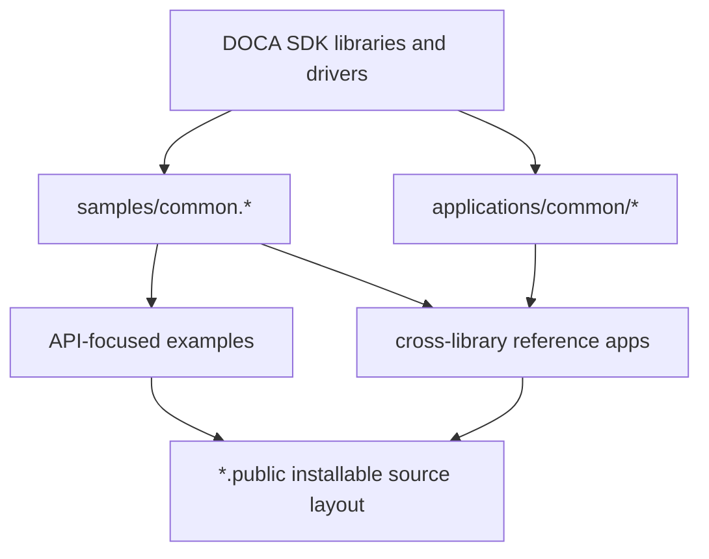
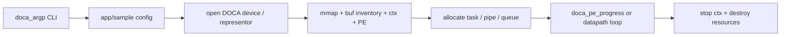

# DOCA Samples Architecture

本文档基于当前仓库代码整理。仓库是 NVIDIA DOCA samples 的 fork，主要用途是展示如何用 DOCA API 在 BlueField/DPU、Host、DPA、GPU 和相关网络/存储栈上构建示例程序。

## 1. Repository Map

```text
.
├── README.md                 # 项目说明、DOCA 安装/编译入口
├── VERSION                   # DOCA samples 版本号
├── samples/                  # 以 DOCA library 为中心的最小 API 样例
│   ├── common.c/.h           # samples 共享的设备、mmap、buf、PE/ctx helper
│   ├── meson.build           # samples 总构建编排
│   └── doca_<lib>/           # 每个 DOCA library 的 sample group
└── applications/             # 跨多个 SDK library 的高级参考应用
    ├── common/               # 应用共享基础库
    ├── meson.build           # applications 总构建编排
    ├── meson_options.txt     # 应用级 feature/options
    └── <application>/        # 单个参考应用
```

当前 Git 跟踪文件约 1534 个，其中 `samples/` 约 1086 个，`applications/` 约 445 个。主要语言是 C，辅以 C++17、CUDA、YAML attributes、Python RPC 脚本、shell build scripts 和少量 JSON/proto 配置。

## 2. Architectural Intent

仓库分成两层：

- `samples/`：教学型、小而直接的 API 用法示例。每个样例通常只证明一个 DOCA API 场景，例如 DMA copy、Flow pipe、RDMA send/write、DPA kernel launch、Telemetry query。
- `applications/`：参考应用型、跨库组合。它们把 DOCA Core、ARGP、COMCH、DMA/RDMA、DPDK、Flow、DevEmu、DPA、GPUNetIO、Telemetry 等组合成更完整的 Host/DPU/GPU 工作流。

整体依赖方向如下：



## 3. Build System

构建系统使用 Meson/Ninja，但本仓库没有单一顶层 `meson.build`。

```sh
cd applications
meson setup --buildtype=debug build
ninja -C build -j16 -v |& tee ../../BuildDocaApplications.log
cd ..
```

```sh
cd samples
SAMPLE_PROJECTS=($(find -name meson.build -not -path "*/dependencies/meson.build" -not -path "./doca_gpunetio/*" -not -path "./doca_rmax/*" -not -path "./doca_urom/*" -printf "%P\n" | xargs dirname | LC_ALL=C sort))
SAMPLE_PROJECTS=($(egrep -lhr "project\(" --include=meson.build | egrep -v "doca_gpunetio|doca_rmax|doca_urom" | xargs dirname | LC_ALL=C sort))
for SAMPLE_PROJECT in ${SAMPLE_PROJECTS[*]}; do
    meson setup --buildtype=debug $SAMPLE_PROJECT/build $SAMPLE_PROJECT
    ninja -C $SAMPLE_PROJECT/build -j8 -v |& tee ../../build_${SAMPLE_PROJECT//\//-}.log
done
cd ..
```

### 3.1 Samples build orchestration

`samples/meson.build` 是 sample 的总编排器：

- 使用 `sample_libs` 声明支持的 DOCA library group，例如 `dma`、`flow`、`rdma`、`dpa`、`gpunetio`、`telemetry`。
- 对每个 `doca_<lib>` 目录执行 `subdir()`，由该目录声明 `samples = [...]`、共享源码、共享头文件、额外依赖。
- 对每个 sample 目录执行 `subdir()`，由样例自己的 `meson.build` 声明 `sample_main_srcs` 和 `sample_srcs`。
- 最终生成可执行文件名 `doca_<sample>`，如果 sample 有 subsystem，则追加 subsystem 名。
- `meson.build.public` 和 `meson_options.txt.public.windows` 等文件用于安装/发布版源码布局。

典型 sample 结构：

```text
samples/doca_dma/
├── meson.build              # 声明 sample list 和 dma_common.*
├── dma_common.c/.h          # library group 共享 helper
└── dma_local_copy/
    ├── meson.build          # 声明 main/sample 源文件
    ├── dma_local_copy_main.c
    └── dma_local_copy_sample.c
```

### 3.2 Applications build orchestration

`applications/meson.build` 是 app 的总编排器：

- `app_list` 按字母顺序声明所有参考应用。
- 每个 app 可以有 `dependencies/meson.build`，用于追加 `app_doca_depends` 和 `app_driver_depends`。
- 总编排器统一检查 `available_libs`、`enabled_drivers`、official build、host/DPU 限制等。
- 每个应用的 `meson.build` 负责组装源码、外部依赖、DPA/GPU 自定义构建目标，以及一个或多个 executable。
- `meson_options.txt` 提供全局开关和 per-application 开关，例如 `enable_dma_copy`、`enable_pcc`、`enable_gpu_packet_processing`。

典型 app 结构：

```text
applications/dma_copy/
├── dependencies/meson.build # argp + dma + comch
├── meson.build              # 生成 doca_dma_copy
├── meson.build.public
├── dma_copy.c               # main、ARGP、COMCH 初始化
├── dma_copy_core.c
└── dma_copy_core.h
```

## 4. Shared Runtime Primitives

### 4.1 `samples/common.*`

`samples/common.h` 定义 `program_core_objects`，这是很多 sample 和 app 的 DOCA Core 基础对象集合：

- `doca_dev *dev`
- `doca_mmap *src_mmap`, `doca_mmap *dst_mmap`
- `doca_buf_inventory *buf_inv`
- `doca_ctx *ctx`
- `doca_pe *pe`

它提供的主要能力：

- 按 PCI、IB device name、interface name、SF index 或 capability 打开 DOCA device。
- 打开 representor device。
- 创建/销毁 mmap、buf inventory、progress engine。
- 停止 DOCA context，并在 `DOCA_ERROR_IN_PROGRESS` 时继续推进 PE。
- 构造 DOCA buf list、hex dump。

### 4.2 `applications/common/*`

`applications/common` 是高级 app 的共享基础设施：

- `utils.*`：SDK version、文件读取、数组初始化、`strlcpy/strlcat` fallback。
- `comch_utils.*`：Host/DPU 之间的 DOCA Comm Channel 初始化、连接、消息回调。
- `dpdk_utils.*`：DPDK EAL、ports/queues、mempool、mbuf 到 DOCA buf 的映射、VF MAC/IP 探测。
- `packet_parser.*`：包头解析。
- `flow_parser.*` 和 `flow_pipes_manager.*`：DOCA Flow pipe/entry 的 ID 管理、flush/destroy/remove helper。
- `telemetry_exporter.*`：Telemetry export 相关公共逻辑。
- `pack.*`：跨端消息结构序列化/打包 helper。

这些 helper 让高级应用可以复用 DPDK、Flow、COMCH、Telemetry 和 DOCA Core 的通用生命周期。

## 5. Samples Layer

`samples/` 按 DOCA library 分组，主要分布如下：

| Group | 样例数量 | 主题 |
| --- | ---: | --- |
| `doca_flow` | 66 | Flow pipe、match/action、RSS、VXLAN/GTP/Geneve、CT、switch、meter/counter |
| `doca_gpunetio` | 14 | GPU packet IO、verbs、RDMA、DMA memcpy、lat/bw benchmarks |
| `doca_rdma` | 14 | RDMA send/receive/read/write/immediate/sync event/multi-conn |
| `doca_apsh` | 13 | App Shield process/module/thread/lib/net/container/VAD 等查询 |
| `doca_devemu` | 10 | PCI/VFS device emulation、DMA、MSI-X、TLP、hotplug |
| `doca_common` | 16 | PE、Graph、sync event、cache invalidate、logging、clock |
| `doca_dpa` | 6 | DPA kernel、initiator/target、ping-pong、verbs、NVQual |
| `doca_eth` | 7 | Eth RXQ/TXQ、managed mempool、batch、LSO |
| 其他 | 1-6 | AES-GCM、COMCH、Compress、DMA、Erasure Coding、MGMT、RMAX、SHA、Telemetry、Telemetry Exporter、UROM、Verbs |

### 5.1 Common sample coding pattern

大多数 sample 遵循同一模式：

1. `<sample>_main.c`：注册 logger、初始化 `doca_argp`、设置默认参数、解析 CLI、调用样例逻辑。
2. `<sample>_sample.c`：实现实际 DOCA API 流程。
3. `<lib>_common.c/.h`：同组 sample 共享 device capability、resource allocation、callback、cleanup。
4. 异步任务通常走 `doca_task_submit()` + `doca_pe_progress()`，在 completion/error callback 中写入状态并减少 remaining task 计数。

以 `samples/doca_dma/dma_local_copy` 为例：

- `dma_local_copy_main.c` 负责 DPU-only 校验、ARGP、buffer 分配。
- `dma_local_copy_sample.c` 负责打开 DMA-capable device、创建 PE/ctx/mmap/buf、分配 `doca_dma_task_memcpy`、提交任务、轮询 PE、清理资源。

### 5.2 Specialized sample groups

- DPA samples 需要 DPACC/device code 构建，`samples/doca_dpa/meson.build` 配置 device link flags、attributes YAML 和 DPA dev libraries。
- GPUNetIO samples 依赖 CUDA/GPU build flags、`gpunetio_device_dep` 和 `gpunetio_device_lib`，并且只支持 amalgamation build。
- Flow/Eth 相关样例按需加入 `applications/common/dpdk_utils.c`，并检查 `doca_dpdk_bridge` + `dpdk` driver。
- UROM samples 仅 Host 支持，DPU 环境会跳过。

## 6. Applications Layer

`applications/` 是跨库参考应用集合，可以按领域理解：

| Domain | Applications | 关键依赖/特征 |
| --- | --- | --- |
| Network datapath | `bifurcated_driver_model`, `eth_l2_fwd`, `simple_fwd_vnf`, `switch`, `ip_frag`, `upf_accel`, `psp_gateway` | DOCA Flow、DPDK、dpdk_bridge、packet parser、pipe manager |
| Security | `app_shield_agent`, `yara_inspection`, `ipsec_security_gw`, `secure_channel`, `file_integrity` | APSH、YARA、IPsec policy/flow、COMCH、SHA、telemetry exporter |
| Storage / emulation | `storage`, `nvme_emulation`, `vblk_pci_dev`, `vnet_pci_dev`, `virtiofs` | COMCH、DMA、RDMA、Compress/GGA、DevEmu、DPA、SPDK、libnfs/glib |
| Compute / offload | `dpa_all_to_all`, `dpu_gpu_remote_offload`, `gpu_packet_processing`, `pcc`, `urom_rdmo` | DPA/DPACC、GPUNetIO/CUDA、PCC, UROM, UCX/FlexIO |
| Telemetry / performance | `telemetry`, `stream_receive_perf`, `time_sync` | Telemetry、RMAX、COMCH、DPA time sync |
| Basic transfer/compression | `dma_copy`, `file_compression` | DMA、COMCH、Compress |

### 6.1 Application composition patterns

- Single-binary apps: `dma_copy`, `file_compression`, `ip_frag`, `switch` 等生成一个 `doca_<app>`。
- Multi-binary apps:
  - `storage` 生成 initiator、RDMA target、COMCH-to-RDMA、GGA offload helper 等多个 binary。
  - `dpu_gpu_remote_offload` 生成 client、server、orchestrator。
  - `telemetry` 生成 traceback 和 opentelemetry 两个 binary。
  - `vblk_pci_dev` 生成主程序、live update 入口和 emulation child。
- Host/DPU split apps:
  - `time_sync` 有 `host/`、`dpu/`、`common/`。
  - `urom_rdmo` 有 `host/`、`dpu/`、`common/`。
  - `pcc` 有 `host/` 和 `device/`。
- Device-code apps:
  - `pcc`, `dpa_all_to_all`, `time_sync/dpu`, `nvme_emulation` 使用 `build_device_code.sh`、attributes YAML 和 DPACC custom target。
  - `gpu_packet_processing` 和 `dpu_gpu_remote_offload/orchestrator` 编译 CUDA `.cu` 文件。

## 7. Control Plane and Data Plane

可以把大部分代码理解成两条路径：



### 7.1 Control plane

- CLI 参数由 `doca_argp` 解析。
- 日志统一使用 `doca_log_backend_create_standard()` 和 SDK warning backend。
- Host/DPU 协商通常用 DOCA COMCH，例如 `dma_copy` 用 COMCH 交换 DMA 方向、exported mmap 和 status。
- 多进程或远端控制的 C++ apps 还会使用本地 TCP socket helper，例如 `storage_common` 和 `remote_offload_common`。

### 7.2 Data plane

- DMA/RDMA: 用 DOCA mmap/export descriptor/remote buffer 建立跨端数据通路。
- Flow/DPDK: 用 DPDK ports/queues/mempool 承载 packet IO，用 DOCA Flow 下发 pipe、match/action、RSS、encap/decap。
- Eth/GPUNetIO: 低层 RXQ/TXQ 或 GPU-side packet processing。
- DPA: device code 编译为 archive，由 host app 装载/调用 DPA kernel 或 device-side service。
- DevEmu: 构造虚拟 PCI/VirtIO/NVMe/Block/Net device 的控制面和 I/O path。

## 8. Dependency and Platform Gating

仓库大量使用构建期 gating，原因是 DOCA app 通常只在特定平台、driver、SDK profile 或 build mode 下可用：

- `available_libs`：检查 DOCA library，例如 `dma`、`comch`、`flow`、`dpa`、`devemu`。
- `enabled_drivers`：检查 driver，例如 `dpdk`、`flexio`、`ucx`。
- `flag_amalgamation_build`：GPUNetIO 相关样例和应用要求该模式。
- `is_linux` / `is_windows` / `is_dpu` / `is_host`：限制 OS 和运行端。
- 外部依赖：`liblz4`、`uuid`、SPDK/DPDK/ISA-L、`libnfs`、`glib-2.0`、`json-c`、gRPC/protobuf 等按 app 检查。

这意味着“源码存在”和“当前环境会编译”不是同一件事；实际可编译集合由 DOCA SDK 安装、driver、Meson options 和目标平台共同决定。

## 9. Public Source Layout

很多目录包含：

- `meson.build`：仓库内部/完整源码构建用。
- `meson.build.public`：安装或公开源码包中使用的 Meson 文件。
- `*.public` build scripts：安装时重命名成普通脚本，例如 `build_device_code.sh.public`。
- `*.public.windows`：Windows 特定 public Meson 入口。

总编排器会安装目录内容，同时排除内部 `meson.build`、`OWNERS`、unit test 目录、内部 device build metadata 等。

## 10. Extending the Repository

### 10.1 Add a new sample

1. 选择或创建 `samples/doca_<lib>/`。
2. 在该 group 的 `meson.build` 追加 `samples = [...]`。
3. 如果需要共享代码，追加到 `sample_lib_srcs`、`sample_lib_hdrs`、`sample_lib_includes`。
4. 创建 `samples/doca_<lib>/<sample>/meson.build`，声明 `sample_main_srcs` 和 `sample_srcs`。
5. 遵循 `<sample>_main.c` + `<sample>_sample.c` 分离：main 处理参数和演示输入，sample 文件承载 DOCA API 主逻辑。
6. 按需在 `dependencies/meson.build` 或 sample 自身 Meson 中追加 DOCA/driver/external dependency 检查。
7. 同步提供 `meson.build.public`，确保 public source package 可构建。

### 10.2 Add a new application

1. 在 `applications/meson.build` 的 `app_list` 添加 app 名称。
2. 在 `applications/meson_options.txt` 添加 `enable_<app>` option。
3. 创建 `applications/<app>/dependencies/meson.build`，声明 DOCA libraries 和 drivers。
4. 创建 app 自身 `meson.build`，组装源码、公共 helper、外部依赖、DPA/GPU custom target。
5. 若有 Host/DPU/device split，使用 `host/`、`dpu/`、`device/`、`common/` 子目录组织。
6. 对跨端协议定义稳定的 message struct 或 protobuf，并集中放在 `common/` 或 app core header。
7. 添加 `meson.build.public` 和需要安装的 `.public` 脚本。

## 11. Maintenance Notes

- `applications/build/` 是本地生成构建目录，不属于架构源码层。
- 该仓库没有统一测试框架，只有 `samples/unit_test/compile_public_samples.sh` 和 round list，以及 `applications/unit_test` 相关清单；当前架构更偏样例/参考实现而非产品级服务。
- 代码风格偏 C SDK sample：显式资源生命周期、goto cleanup、`doca_error_t` 逐层返回、DOCA logging。
- 阅读复杂 app 时优先看 `dependencies/meson.build` 和 `<app>_core.h`，通常能最快定位它的系统边界、消息结构和外部依赖。
