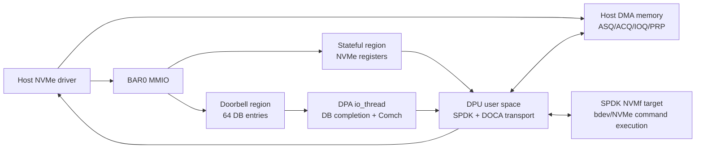
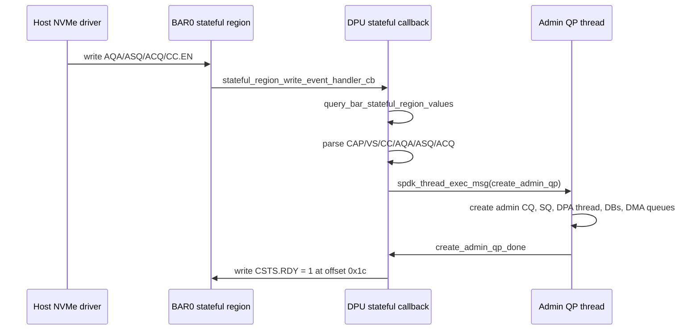
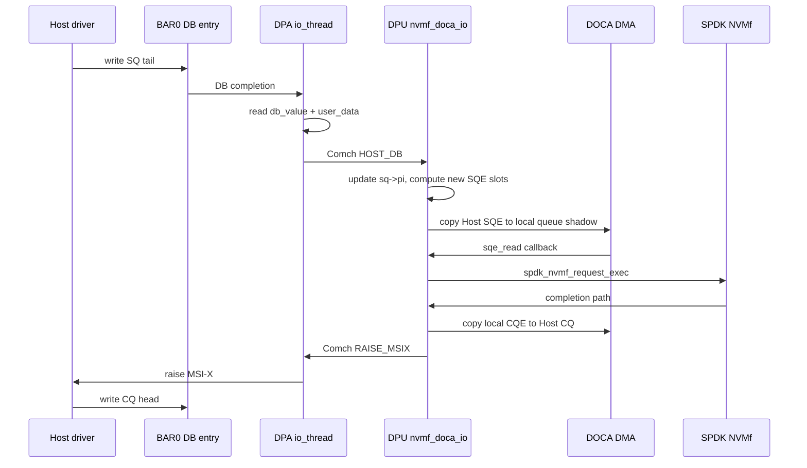
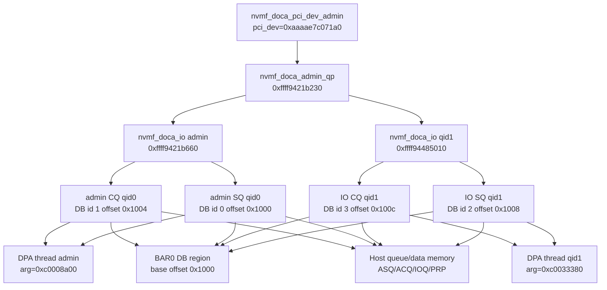

# NVMe Emulation BAR/Admin Queue/DB/DPA 布局详解

本文聚焦 `applications/nvme_emulation` 中 Host 真实可见的 BAR、admin queue、SQ/CQ、data buffer、doorbell(DB) 和 DPA 之间的关系。文中的静态布局来自源码，运行时样本来自 2026-07-16 在当前环境的实测：

- DPU target：`applications/build/nvme_emulation/doca_nvme_emulation`
- emulation manager：`mlx5_bond_0`
- VUID：`MT2529603G38GES2D0F0`
- Host PCI BDF：`0000:41:00.0`
- Host NVMe device：`/dev/nvme2n1`

为拿到真实运行时地址和句柄，本次在 `host/doca_transport.c`、`host/nvmf_doca_io.c` 临时增加了 `NVME_EMU_LAYOUT` 日志。日志只观测布局，不改变队列、DMA、DB 和 SPDK 行为。

## 1. 总览

`nvme_emulation` 在 DPU 用户态创建一个 DOCA DevEmu PCI endpoint。Host NVMe driver 看到的是一个标准 NVMe PCI controller，主要通过三类路径和 DPU 交互：

1. BAR0 stateful region：Host 读写 NVMe controller registers，例如 `CAP/VS/CC/CSTS/AQA/ASQ/ACQ`。
2. BAR0 DB region：Host 写 SQ/CQ doorbell，DPA 收到 DB completion，再通过 Comch 把 `db_value` 转回 DPU 用户态。
3. Host memory DMA：DPU 用户态通过 DOCA mmap/inventory/buf/DMA 读取 Host SQE、写回 Host CQE、复制 PRP 指向的数据。



## 2. BAR 静态布局

源码入口：`applications/nvme_emulation/host/nvme_pci_type_config.h`。

| 项 | 源码配置 | Host/语义 |
| --- | --- | --- |
| PCI vendor/device | `0x15b3 / 0x6001` | Host 枚举为 Mellanox NVMe SNAP Controller。 |
| PCI subsystem | `0x15b3 / 0x0051` | lspci subsystem。 |
| class code | `0x010802` | NVMe controller, prog-if 02。 |
| BAR0 | `log_size=0xf` | 32 KiB, 64-bit, non-prefetchable。 |
| BAR1 | `log_size=0x0` | 配置存在，但当前 Host resource 未显示有效窗口，主路径不使用。 |
| stateful region | BAR0 `0x0000 + 0x80` | NVMe controller registers。 |
| DB region | BAR0 `0x1000 + 0x1000` | 64 个 doorbell，单 DB 4B，stride 4B。 |
| MSI-X table | BAR0 `0x2000 + 0x1000` | 4 个 MSI-X vector。 |
| MSI-X PBA | BAR0 `0x3000 + 0x1000` | pending bit array。 |

BAR0 内部偏移图：

```text
BAR0, size 0x8000

0x0000  +------------------------------+
        | NVMe stateful registers      | 0x80
0x0080  +------------------------------+
        | unused / not configured      |
0x1000  +------------------------------+
        | DB region                    | 0x1000
0x2000  +------------------------------+
        | MSI-X table                  | 0x1000
0x3000  +------------------------------+
        | MSI-X PBA                    | 0x1000
0x4000  +------------------------------+
        | unused / not configured      |
0x8000  +------------------------------+
```

本次 Host 侧实测：

| 项 | 实测值 |
| --- | --- |
| BDF | `0000:41:00.0` |
| BAR0 Host physical window | `0xc4800000 - 0xc4807fff` |
| BAR0 size | `0x8000` / 32 KiB |
| lspci region | `Memory at c4800000 (64-bit, non-prefetchable) [size=32K]` |
| MSI-X | enabled, count `4` |
| MSI-X table | BAR0 offset `0x2000` |
| MSI-X PBA | BAR0 offset `0x3000` |

把源码偏移加到 Host BAR0 物理基址后，可得到 Host 视角的 MMIO 地址：

| BAR0 偏移 | Host 物理地址 | 内容 |
| --- | --- | --- |
| `0x0000 - 0x007f` | `0xc4800000 - 0xc480007f` | NVMe controller registers。 |
| `0x1000 - 0x1fff` | `0xc4801000 - 0xc4801fff` | DB region。 |
| `0x2000 - 0x2fff` | `0xc4802000 - 0xc4802fff` | MSI-X table。 |
| `0x3000 - 0x3fff` | `0xc4803000 - 0xc4803fff` | MSI-X PBA。 |

## 3. Stateful Register Layout

源码结构体：`struct nvmf_doca_nvme_registers` in `host/doca_transport.c`。

| Offset | Size | 字段 | 方向 | 说明 |
| --- | ---: | --- | --- | --- |
| `0x00` | 8 | `CAP` | DPU default -> Host read | Controller capability。 |
| `0x08` | 4 | `VS` | DPU default -> Host read | NVMe version。 |
| `0x0c` | 4 | `INTMS` | Host write | Interrupt mask set，当前代码不做深处理。 |
| `0x10` | 4 | `INTMC` | Host write | Interrupt mask clear，当前代码不做深处理。 |
| `0x14` | 4 | `CC` | Host write | Controller configuration。`CC.EN=1` 触发 admin QP 创建。 |
| `0x18` | 4 | reserved | - | 保留。 |
| `0x1c` | 4 | `CSTS` | DPU write -> Host read | Controller status。代码在 admin QP ready 后写 offset `28` 的 `RDY=1`。 |
| `0x20` | 4 | `NSSR` | Host write | NVM subsystem reset。 |
| `0x24` | 4 | `AQA` | Host write | Admin queue attributes。 |
| `0x28` | 8 | `ASQ` | Host write | Admin SQ Host physical/I/O address。 |
| `0x30` | 8 | `ACQ` | Host write | Admin CQ Host physical/I/O address。 |
| `0x38 - 0x7f` | 72 | unused | - | stateful region 预留。 |

默认寄存器由 `nvmf_doca_pci_type_create_and_start()` 写入 type default stateful values：

| 字段 | 默认实测 raw | 关键含义 |
| --- | --- | --- |
| `CAP` | `0x20f00101ff` | `MQES=511`，`CQR=1`，`TO=0xf0`，`CSS=1`，`DSTRD=0`。 |
| `VS` | `0x00010300` | NVMe 1.3。 |

Host enable controller 后，本次实测 stateful 内容：

| 字段 | 实测值 | 解释 |
| --- | --- | --- |
| `CC` | `0x00460001` | `EN=1`，`IOSQES=6`，`IOCQES=4`。也就是 SQE 64B、CQE 16B。 |
| `CSTS` | `0x0` at query time | 创建 admin QP 前尚未 ready；随后 DPU 写 `CSTS.RDY=1`。 |
| `AQA` | `0x001f001f` | `ASQS=31`、`ACQS=31`，实际 admin SQ/CQ depth 都是 32。 |
| `ASQ` | `0x1100a0000` | Host admin submission queue base。 |
| `ACQ` | `0x1c7c5c000` | Host admin completion queue base。 |

stateful write 触发链：



## 4. Admin Queue Layout

Admin queue 的 Host 地址完全来自 Host 写入的 `ASQ/ACQ/AQA`。DPU 不分配 Host queue memory，只用 DOCA host mmap 把这些 Host I/O address 包装成 `doca_buf`，然后用 DMA 读 SQE、写 CQE。

本次实测 admin queue：

| 项 | Admin SQ | Admin CQ |
| --- | --- | --- |
| qid | `0` | `0` |
| Host base | `0x1100a0000` | `0x1c7c5c000` |
| depth | `32` | `32` |
| element size | `64` | `16` |
| total bytes | `0x800` | `0x200` |
| last element start | `0x1100a07c0` | `0x1c7c5c1f0` |
| DPU local shadow base | `0xffff943db050` | `0xffff9436f830` |
| queue object | `0xffff943e55b0` | `0xffff9421b6e0` |
| owner object | `sq=0xffff943e5550` | `cq=0xffff9421b6d8` |
| `nvmf_doca_io` | `0xffff9421b660` | `0xffff9421b660` |
| DB id | `0` | `1` |
| DB BAR0 offset | `0x1000` | `0x1004` |
| DB DPA handle | `0xc0033340` | `0xc0033300` |
| DB user_data | SQ pointer `0xffff943e5550` | `0` |

注：Admin SQ/CQ 都有 DB DPA handle，但进入 DPA thread 的路径不同。CQ DB handle 在 `nvmf_doca_io_run_dpa_thread()` 中作为 `io_thread_init_rpc()` 参数传给 DPA，并在 thread 初始化时绑定到 DB completion context；SQ DB handle 则保存在 `sq->db_handle`，后续通过 `COMCH_MSG_TYPE_BIND_SQ_DB` 消息动态发送给 DPA 绑定。

Admin SQ/CQ 与 DPU 对象关系：

```text
nvmf_doca_admin_qp 0xffff9421b230
  admin_cq -> nvmf_doca_io 0xffff9421b660
    cq -> nvmf_doca_cq 0xffff9421b6d8
      queue -> local_to_remote DMA queue
      DB id 1, BAR0+0x1004
      DPA thread receives CQ doorbell
  admin_sq -> nvmf_doca_sq 0xffff943e5550
    queue -> remote_to_local DMA queue
    data_pool -> Host PRP/data copy buffers
    request_pool -> one request object per SQ slot
    DB id 0, BAR0+0x1000
```

Admin SQE/CQE 方向：

| 队列 | DMA 方向 | `nvmf_doca_queue_create()` mode | 含义 |
| --- | --- | --- | --- |
| Admin SQ | Host -> DPU | `remote_to_local` | Host 写 SQE，DPU 收到 SQ DB 后按 slot DMA 读 SQE。 |
| Admin CQ | DPU -> Host | `local_to_remote` | SPDK 完成请求后，DPU 生成 CQE 并 DMA 写回 Host ACQ。 |

Admin queue 初始化后，DPU 写 `CSTS.RDY=1`。此后 Host 开始敲 admin SQ doorbell，实测最初 admin SQE 如下：

| SQE idx | opcode | cid | cdw10 | cdw11 | PRP1 | 含义 |
| ---: | --- | ---: | --- | --- | --- | --- |
| 0 | `0x06` | `4116` | `0x1` | `0x0` | `0x1c28de000` | Identify。 |
| 1 | `0x02` | `4117` | `0x03ff0005` | `0x0` | `0x1c28d9000` | Get Log Page 类命令。 |
| 2 | `0x09` | `4118` | `0x7` | `0x017f017f` | `0x0` | Set Features。 |
| 3 | `0x05` | `4119` | `0x01ff0001` | `0x00010003` | `0x10bf64000` | Create IO CQ qid 1，Host CQ base 在 PRP1。 |
| 4 | `0x01` | `8212` | `0x01ff0001` | `0x00010001` | `0x141d80000` | Create IO SQ qid 1，Host SQ base 在 PRP1。 |

注意：admin command 的 data buffer 和 IO queue create 的 PRP1 含义不同。Identify/Get Log Page 的 PRP1 指向 data buffer；Create IO CQ/SQ 的 PRP1 指向 Host CQ/SQ queue memory base。

## 5. Doorbell Layout

DB region 在 BAR0 `0x1000`，共 64 个 DB，每个 DB 4 字节，stride 4 字节。代码中 DB id 固定按 NVMe queue id 计算：

```text
SQ DB id = 2 * qid
CQ DB id = 2 * qid + 1
DB BAR0 offset = 0x1000 + DB id * 4
Host physical DB address = BAR0_host_base + DB BAR0 offset
```

在本次 Host BAR0 base `0xc4800000` 下，前几个 doorbell 地址如下：

| Queue | DB id | BAR0 offset | Host physical address | DPU user_data | 语义 |
| --- | ---: | --- | --- | --- | --- |
| Admin SQ qid 0 | 0 | `0x1000` | `0xc4801000` | SQ pointer | Host 写 SQ tail，DPU 称为 `SQ_PI`。 |
| Admin CQ qid 0 | 1 | `0x1004` | `0xc4801004` | `0` | Host 写 CQ head，DPU 称为 `CQ_CI`。 |
| IO SQ qid 1 | 2 | `0x1008` | `0xc4801008` | SQ pointer | IO SQ tail。 |
| IO CQ qid 1 | 3 | `0x100c` | `0xc480100c` | `0` | IO CQ head。 |
| IO SQ qid 2 | 4 | `0x1010` | `0xc4801010` | SQ pointer | IO SQ tail。 |
| IO CQ qid 2 | 5 | `0x1014` | `0xc4801014` | `0` | IO CQ head。 |

`PCI_TYPE_NUM_DB=64`，按上述偶/奇配对可覆盖 qid `0..31` 的 SQ/CQ doorbell。源码中的 Create IO CQ/SQ 路径直接按 qid 推导 DB id；如果 Host 请求超过 DB region 可承载范围，失败点会落在 DOCA DB 创建/start/bind。

## 6. DPA 与 DB/Comch 关系

每个 `nvmf_doca_io` 创建一个 DPA `io_thread`。这个 `io_thread` 做两件事：

1. 处理 DPU 发来的 Comch 控制消息：bind SQ DB、unbind SQ DB、raise MSI-X。
2. 轮询 Host 写 DB 产生的 DB completion，把 DB value 和 DB user_data 通过 Comch 发回 DPU 用户态。

CQ DB 与 SQ DB 的绑定方式不同：

| DB 类型 | 创建位置 | DPA bind 时机 | 原因 |
| --- | --- | --- | --- |
| CQ DB | `nvmf_doca_cq_create()` | `io_thread_init_rpc()` 直接 bind 到 DPA DB completion | 每个 `nvmf_doca_io` 必有一个 CQ，DPA thread 启动前就确定。 |
| SQ DB | `nvmf_doca_sq_create()` | DPU 通过 Comch 发送 `COMCH_MSG_TYPE_BIND_SQ_DB`，DPA 回复 `BIND_SQ_DB_DONE` | SQ 可以在 DPA thread 运行后动态增删。 |

DPA 端 `handle_db()` 做的事非常薄：

```text
Host writes BAR0 doorbell
  -> DOCA DevEmu produces DB completion on DPA
  -> DPA reads db_value
  -> DPA packages:
       type = COMCH_MSG_TYPE_HOST_DB
       db_user_data = DB configured user_data
       db_value = Host written value
  -> Comch immediate-only send to DPU user space
```

DPU 用户态收到 `COMCH_MSG_TYPE_HOST_DB` 后通过 `db_user_data` 区分 SQ/CQ：

| `db_user_data` | DPU 判断 | 处理 |
| --- | --- | --- |
| `0` | CQ doorbell | 更新 CQ consumer/head shadow，不读 SQE。 |
| 非 0，且等于 SQ pointer | SQ doorbell | 把 `db_value` 当新 SQ tail，计算新增 SQE 数并 DMA fetch。 |

实测初始 DB 消息：

| 时间点 | io | target | sq | cq | db_value |
| --- | --- | --- | --- | --- | ---: |
| admin ready 前后 | `0xffff9421b660` | `CQ_CI` | `nil` | `0xffff9421b6d8` | 0 |
| admin ready 前后 | `0xffff9421b660` | `SQ_PI` | `0xffff943e5550` | `0xffff9421b6d8` | 0 |
| 第一条 admin command | `0xffff9421b660` | `SQ_PI` | `0xffff943e5550` | `0xffff9421b6d8` | 1 |
| 第一条 CQ 消费 | `0xffff9421b660` | `CQ_CI` | `nil` | `0xffff9421b6d8` | 1 |



## 7. IO Queue Runtime Samples

Host 在 admin queue 上发 Create IO CQ/SQ 后，DPU 选择 poll group，创建 `nvmf_doca_io` 和 `nvmf_doca_sq`，并把 IO CQ/SQ 挂到 `admin_qp->io_cqs` / `admin_qp->io_sqs`。

本次实测 qid 1：

| 项 | IO SQ qid 1 | IO CQ qid 1 |
| --- | --- | --- |
| Host base | `0x141d80000` | `0x10bf64000` |
| depth | `512` | `512` |
| element size | `64` | `16` |
| total bytes | `0x8000` | `0x2000` |
| local shadow base | `0xaaaae82b8290` | `0xaaaae8193050` |
| `nvmf_doca_io` | `0xffff94485010` | `0xffff94485010` |
| object | `sq=0xffff94485150` | `cq=0xffff94485088` |
| DB id | `2` | `3` |
| DB BAR0 offset | `0x1008` | `0x100c` |
| DB handle | `0xc0033b40` | `0xc0033b00` |
| data pool | `0xffff944851e0` | - |

qid 1 data pool：

| 字段 | 实测值 |
| --- | --- |
| `max_ops` | `16896` |
| buffer size | `0x1000` |
| local base | `0x20005f7dff00` |
| local bytes | `0x4200000` |
| local mmap | `0xaaaae82b3280` |
| host mmap | `0xaaaae7d67580` |
| host inventory | `0xaaaae82adf40` |
| DMA ctx | `0xaaaae82b3580` |

SPDK 统计中，本次运行 Host 最终建立了 1 个 admin qpair 和 3 个 IO qpair：

| poll group | current admin qpairs | current io qpairs | completed NVMe IO |
| --- | ---: | ---: | ---: |
| `nvmf_tgt_poll_group_0` | 1 | 1 | 1 |
| `nvmf_tgt_poll_group_1` | 0 | 2 | 54 |

## 8. data_buf / PRP / DMA 关系

`data_pool` 不在 BAR 内，也不是 Host queue memory。它是每个 SQ 独有的 DPU 本地 DMA buffer 池，用于承接 NVMe command 的 PRP 数据：

- Host SQE/CQE queue shadow：`nvmf_doca_queue`，按 SQE/CQE element 粒度固定创建 DMA task。
- Host data buffer：由 NVMe command 的 PRP1/PRP2 描述，按请求动态创建 `doca_buf`。
- DPU data buffer：来自 SQ 的 `data_pool.local_data_pool`，每个 buffer 默认 `0x1000`。
- request pool：每个 SQ 一个 `request_pool_memory`，每个 SQ slot 对应一个 `nvmf_doca_request` 可复用对象。

数据路径按 opcode 方向分两类：

```text
NVM write / Host -> DPU:
  Host PRP data buffer
    -> nvmf_doca_sq_get_host_buffer()
    -> nvmf_doca_sq_get_dpu_buffer()
    -> nvmf_doca_sq_copy_data(dst=dpu_buffer, src=host_buffer)
    -> spdk_nvmf_request_exec()
    -> post CQE

NVM read / DPU -> Host:
  spdk_nvmf_request_exec()
    -> SPDK fills DPU iov/data buffer
    -> nvmf_doca_sq_copy_data(dst=host_buffer, src=dpu_buffer)
    -> post CQE
```

PRP 映射规则：

| 情况 | 处理 |
| --- | --- |
| 数据全部落在 PRP1 页内 | 只创建 `host_buffer[0]` 和 `dpu_buffer[0]`。 |
| 跨一页且剩余不超过 4 KiB | `PRP1` 和 `PRP2` 分别作为两个 data buffer。 |
| 超过两页 | `PRP2` 是 PRP list 地址；先把 PRP list DMA 到 DPU，再逐项创建 Host/DPU buffer。 |

Admin command 的 data path 有一个特殊点：如果不是 NVM SQ，`init_dpu_host_buffers()` 直接使用 `cmd->dptr.prp.prp1` 作为单个 Host data buffer，不走多页 PRP list 展开。IO command 才完整处理 PRP/SGL 选择，其中当前路径只支持 PRP。

## 9. 对象关系图



## 10. 关键因果关系

| 事件 | 真实写入/对象 | 后续动作 |
| --- | --- | --- |
| Host 枚举 PCI | 读 BAR0 `CAP/VS` | NVMe driver 判断 controller 能力。 |
| Host 写 `AQA/ASQ/ACQ` | `AQA=0x1f001f`，`ASQ=0x1100a0000`，`ACQ=0x1c7c5c000` | DPU stateful callback 能拿到 admin queue layout。 |
| Host 写 `CC.EN=1` | `CC=0x460001` | DPU 创建 admin QP。 |
| DPU 创建 admin CQ | host CQ `0x1c7c5c000`，DB id 1 | DPA thread 直接 bind CQ DB。 |
| DPU 创建 admin SQ | host SQ `0x1100a0000`，DB id 0 | DPU 通过 Comch 请求 DPA bind SQ DB。 |
| Admin QP ready | DPU 写 `CSTS.RDY=1` | Host 开始提交 admin commands。 |
| Host 写 admin SQ DB | BAR0 `0x1000`，value 从 0/1/... 递增 | DPA 发送 `HOST_DB`，DPU DMA fetch SQE。 |
| Admin Create IO CQ | opcode `0x05`，PRP1 是 Host CQ base | DPU 创建 `nvmf_doca_io`、CQ queue、CQ DB。 |
| Admin Create IO SQ | opcode `0x01`，PRP1 是 Host SQ base | DPU 创建 SQ queue、data_pool、request_pool、SQ DB。 |
| IO command | Host 写 IO SQ DB | DPU fetch SQE，按 PRP 做 Host/DPU data DMA，SPDK 执行，写 CQE，raise MSI-X。 |

## 11. 本次实测 Host NVMe 视角

Host 枚举结果：

| 项 | 值 |
| --- | --- |
| PCI | `0000:41:00.0 Non-Volatile memory controller [0108]: Mellanox Technologies NVMe SNAP Controller [15b3:6001]` |
| kernel driver | `nvme` |
| block device | `/dev/nvme2n1` |
| serial | `DOCA000000000001` |
| model | `SPDK bdev Controller` |
| namespace size | `67.11 MB / 64 MiB` |
| NVMe version | `0x10300` |
| controller SQES/CQES | `sqes=0x66`，`cqes=0x44` |
| namespace `nsze/ncap/nuse` | `0x20000 / 0x20000 / 0x20000` |

## 12. 调试建议

当需要继续分析 layout 或定位队列问题时，建议保留以下日志点：

| 日志点 | 价值 |
| --- | --- |
| `pci_type started` | 一次性确认 BAR/stateful/DB/MSI-X 静态布局。 |
| `controller_enable` | 捕获 Host 真正写入的 `CC/AQA/ASQ/ACQ`。 |
| `queue_create` | 捕获 Host queue base、DPU local shadow、element size、队列方向。 |
| `cq_create` / `sq_create` | 捕获 qid、DB id、BAR offset、DPA DB handle、SQ data_pool。 |
| `host_db` | 观察 Host doorbell value 和 DPA->DPU 转发是否正常。 |
| `sq_pi_update` | 验证 SQ tail 到待 fetch SQE 范围的计算。 |
| `sqe_read` | 直接看到 SQE opcode/cid/PRP，判断 admin/IO 命令序列。 |

如果日志量影响性能，可以只保留创建阶段日志，并把 `host_db/sq_pi_update/sqe_read` 限制为前 N 条或改成 trace level。
