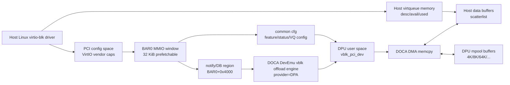
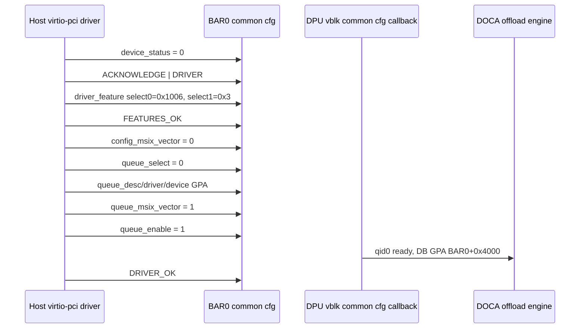
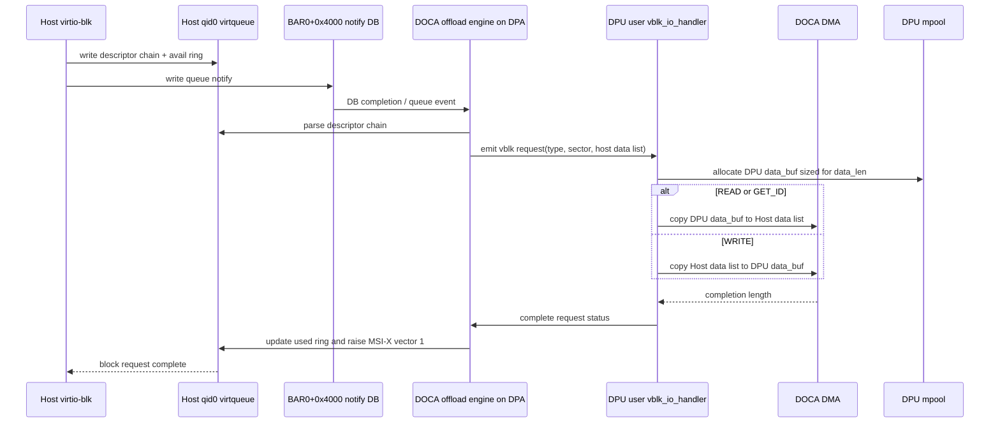

# vblk_pci_dev BAR/Admin Queue/DB/DPA 布局详解

本文聚焦 `applications/vblk_pci_dev` 中 Host 真实可见的 VirtIO block PCI
BAR、virtio common config、admin queue 字段、virtqueue、data buffer、doorbell(DB)
和 DPA/offload engine 之间的关系。静态布局来自源码，运行时样本来自
2026-07-16 在当前 100GbE BF3 环境的实测。

本次实测参数：

- DPU target：`applications/build/vblk_pci_dev/doca_vblk_pci_dev`
- emulation manager：`mlx5_bond_0`
- 启动参数：`-d mlx5_bond_0 -n 1 -H 0 -q 1 --io-ctx-mask 0x1 --tlp-core-idx 15 --offload-engine-core-idx 0 --provider DPA -l 50 --sdk-log-level 40`
- Host PCI BDF：`0000:48:00.0`
- Host block device：`/dev/vda`
- Host block serial：`vblk_bdev0`

为拿到真实运行时地址和句柄，本次在 `vblk_pci.c`、`vblk_ctrl.c`、
`vblk_mpool.c` 临时增加了 `VBLK_LAYOUT`、`VBLK_QUEUE`、`VBLK_IO_*`
日志。日志只观测布局、队列配置和 DMA buffer，不改变 virtio 队列、
DB、DMA 或 DOCA offload engine 行为。

## 1. 总览

`vblk_pci_dev` 在 DPU 用户态创建一个 DOCA DevEmu PCI endpoint。Host
看到的是标准 VirtIO 1.0 block PCI 设备，并由 Linux `virtio-pci` 驱动绑定。
Host 与 DPU 的交互路径分为四类：

1. PCI config space：Host 读取 VirtIO vendor capabilities，定位 common
   config、notify、ISR、device config 和 MSI-X 区域。
2. BAR0 common/device config：Host 写 feature、status、queue address、queue
   enable、MSI-X vector 等配置；DPU 用户态处理这些 MMIO TLP。
3. BAR0 notify/DB region：Host 写 queue notify doorbell；当前 sample 由
   DOCA DevEmu/offload engine/DPA 路径消费 DB 并转成 vblk request 事件。
4. Host memory DMA：Host virtqueue descriptor 指向 Host data buffer；DPU
   通过 DOCA vblk request API 拿到 Host data `doca_buf`，再用 DOCA DMA 在
   Host data buffer 和 DPU mpool buffer 之间复制。

观测边界：

1. 当前 `vblk_pci_dev` 的普通 TLP/MMIO handler 只处理 common/device config 等 transaction region。
DOCA DevEmu 头文件注释说明，针对 DB 或 MSI-X region 的 TLP request 不会触发普通 TLP channel callback，
因此 `vblk_pci_dev` 无法直接获取 DB payload 或 MSI-X message。
2. 当前 `vblk_pci_dev` 只把 `queue_desc/driver/device` 这些 Host GPA 传给 DOCA DevEmu，
DOCA vblk offload engine 通过 PCIe DMA 读取 Host 内存中的 vring desc/avail/used，并在内部维护/推进 avail/used idx；
因此 `vblk_pci_dev` 不手动读取/解析 vring，无法直接获取 avail/used idx，callback 收到的是已经解析好的 vblk_req。



## 2. PCI 与 BAR0 静态布局

源码创建的 endpoint 是 VirtIO block 设备：

| 项 | 值 | Host/语义 |
| --- | --- | --- |
| PCI vendor/device | `0x1af4 / 0x1042` | VirtIO 1.0 block device。 |
| PCI subsystem | `0x1af4 / 0x0002` | VirtIO block subsystem。 |
| class code | `0x010802` | Host `lspci` 显示为 NVMe class，但 driver 通过 VirtIO capability 绑定 `virtio-pci`。 |
| BAR0 | `log_size=15` | 32 KiB，64-bit，prefetchable。 |
| BAR1 | `log_size=0` | 当前 sample 不使用。 |
| MSI-X vector | `2` | config vector 和 queue vector 各 1 个。 |
| DB count | `1` | 当前只创建 1 个 virtqueue notify DB。 |

BAR0 内部偏移图：

```text
BAR0, size 0x8000

0x0000  +--------------------------------+
        | VirtIO common cfg              | 0x100
0x0100  +--------------------------------+
        | ISR status                     | 0x1
0x0101  +--------------------------------+
        | reserved                       |
0x0200  +--------------------------------+
        | VirtIO block device cfg        | 0x100
0x0300  +--------------------------------+
        | reserved                       |
0x2000  +--------------------------------+
        | MSI-X table                    | 0x1000
0x3000  +--------------------------------+
        | MSI-X PBA                      | 0x1000
0x4000  +--------------------------------+
        | notify / DB region             | 0x1000
0x5000  +--------------------------------+
        | reserved                       |
0x8000  +--------------------------------+
```

静态偏移：

| BAR0 offset | Size | 内容 | 处理路径 |
| --- | ---: | --- | --- |
| `0x0000 - 0x00ff` | `0x100` | VirtIO common cfg | DPU TLP/MMIO callback。 |
| `0x0100` | `0x1` | ISR status | Host read。 |
| `0x0200 - 0x02ff` | `0x100` | VirtIO block device cfg | Host read block capacity/geometry 等。 |
| `0x2000 - 0x2fff` | `0x1000` | MSI-X table | DOCA DevEmu MSI-X。 |
| `0x3000 - 0x3fff` | `0x1000` | MSI-X PBA | DOCA DevEmu MSI-X。 |
| `0x4000 - 0x4fff` | `0x1000` | notify/DB region | DOCA DevEmu/offload engine/DPA。 |

Host 实测：

| 项 | 实测值 |
| --- | --- |
| BDF | `0000:48:00.0` |
| BAR0 Host physical window | `0x38385100000 - 0x38385107fff` |
| BAR0 size | `0x8000` / 32 KiB |
| lspci region | `Memory at 38385100000 (64-bit, prefetchable) [size=32K]` |
| MSI-X | enabled, count `2` |
| MSI-X table | BAR0 offset `0x2000` |
| MSI-X PBA | BAR0 offset `0x3000` |
| Kernel driver | `virtio-pci` |

把 BAR0 偏移加到 Host BAR0 物理基址后，可得到 Host 视角 MMIO 地址：

| BAR0 offset | Host physical address | 内容 |
| --- | --- | --- |
| `0x0000 - 0x00ff` | `0x38385100000 - 0x383851000ff` | common cfg。 |
| `0x0100` | `0x38385100100` | ISR status。 |
| `0x0200 - 0x02ff` | `0x38385100200 - 0x383851002ff` | block device cfg。 |
| `0x2000 - 0x2fff` | `0x38385102000 - 0x38385102fff` | MSI-X table。 |
| `0x3000 - 0x3fff` | `0x38385103000 - 0x38385103fff` | MSI-X PBA。 |
| `0x4000 - 0x4fff` | `0x38385104000 - 0x38385104fff` | notify/DB region。 |

## 3. VirtIO PCI Capability Layout

Host 通过 PCI config space 中的 VirtIO vendor capabilities 找到 BAR0 内部布局。
本次 Host `lspci -vv` 与 DPU 日志一致：

| Config offset | Capability | BAR | BAR offset | Size/参数 |
| --- | --- | ---: | --- | --- |
| `0x7c` | MSI-X | `0` | table `0x2000`, PBA `0x3000` | count `2`。 |
| `0x88` | VirtIO CommonCfg | `0` | `0x0000` | `0x100`。 |
| `0x98` | VirtIO Notify | `0` | `0x4000` | `0x1000`, multiplier `0`。 |
| `0xac` | VirtIO ISR | `0` | `0x0100` | `0x1`。 |
| `0xbc` | VirtIO DeviceCfg | `0` | `0x0200` | `0x100`。 |
| `0xcc` | VirtIO PCI cfg cap | `0` | `0x0000` | 当前 sample 未提供额外窗口。 |

`notify_off_multiplier=0`，因此队列 DB 地址为：

```text
queue_db_gpa = BAR0_base + 0x4000 + queue_notify_off * 0
```

本次 qid 0 的 `queue_notify_off=0`，所以 DB GPA 是：

```text
0x38385100000 + 0x4000 = 0x38385104000
```

## 4. Common Config Layout

common config 位于 BAR0 `0x0000 - 0x00ff`。本 sample 实测结构体大小为
`0x40`，其中 admin queue 字段存在于末尾，但当前不启用。

| Offset | Size | 字段 | 方向 | 本次最终值/说明 |
| --- | ---: | --- | --- | --- |
| `0x00` | 4 | `device_feature_select` | Host write | Host 选择读取哪一组 device feature。 |
| `0x04` | 4 | `device_feature` | Host read | DPU 上报 feature。 |
| `0x08` | 4 | `driver_feature_select` | Host write | Host 选择写入哪一组 driver feature。 |
| `0x0c` | 4 | `driver_feature` | Host write | select 0 写 `0x1006`，select 1 写 `0x3`。 |
| `0x10` | 2 | `config_msix_vector` | Host write | `0`，用于 config change interrupt。 |
| `0x12` | 2 | `num_queues` | Host read | `1`。 |
| `0x14` | 1 | `device_status` | Host write/read | `0 -> 1 -> 3 -> 11 -> 15`，最终 DRIVER_OK。 |
| `0x15` | 1 | `config_generation` | Host read | 当前 sample 静态值。 |
| `0x16` | 2 | `queue_select` | Host write | `0`。 |
| `0x18` | 2 | `queue_size` | Host write/read | `256`。 |
| `0x1a` | 2 | `queue_msix_vector` | Host write | `1`。 |
| `0x1c` | 2 | `queue_enable` | Host write | `1`。 |
| `0x1e` | 2 | `queue_notify_off` | Host read | `0`。 |
| `0x20` | 8 | `queue_desc` | Host write | `0x200382000`。 |
| `0x28` | 8 | `queue_driver` | Host write | `0x200383000`，即 avail ring。 |
| `0x30` | 8 | `queue_device` | Host write | `0x200383240`，即 used ring。 |
| `0x38` | 2 | `queue_notif_config_data` | Host read | `0`。 |
| `0x3a` | 2 | `queue_reset` | Host write/read | 当前未触发 reset。 |
| `0x3c` | 2 | `admin_queue_index` | Host read | `0`，未启用。 |
| `0x3e` | 2 | `admin_queue_num` | Host read | `0`，未启用。 |

Feature 协商：

| Select | Host driver 写入 | 含义 |
| ---: | --- | --- |
| `0` | `0x00001006` | bit 1 `SIZE_MAX`，bit 2 `SEG_MAX`，bit 12 `MQ`。 |
| `1` | `0x00000003` | 全局 bit 32 `VERSION_1`，bit 33 `ACCESS_PLATFORM`。 |

设备状态序列：

```text
64 -> 0 -> 1 -> 3 -> 11 -> 15

0x01 ACKNOWLEDGE
0x02 DRIVER
0x08 FEATURES_OK
0x04 DRIVER_OK
```

`64` 是上一次实例/复位前可见的 `DEVICE_NEEDS_RESET` 状态；Host 重新初始化时先写
`0` 清状态，然后推进到 `15`。

## 5. Admin Queue Layout

VirtIO 1.2 common config 中可以包含 admin queue 字段；当前 `vblk_pci_dev`
确实暴露了字段位置，但本 sample 不启用 admin virtqueue。

| 字段 | Offset | 本次值 | 结论 |
| --- | --- | --- | --- |
| `admin_queue_index` | `0x3c` | `0` | 字段存在，但没有指向单独 admin queue。 |
| `admin_queue_num` | `0x3e` | `0` | Host 可用 admin queue 数量为 0。 |

因此当前 `vblk_pci_dev` 没有独立 admin queue memory，也没有 admin SQ/CQ/DB。
所有控制面初始化都通过 PCI config capability 和 BAR0 common/device config 完成；
所有数据面请求都走 qid 0 virtqueue。

```text
Admin queue memory:
  Host ASQ/ACQ-like queue: none
  Host admin descriptor ring: none
  Admin DB: none
  DPU admin queue object: none

Common cfg admin fields:
  BAR0+0x3c admin_queue_index = 0
  BAR0+0x3e admin_queue_num   = 0
```

## 6. Virtqueue 0 Layout

当前运行参数 `-q 1`，所以只有 qid 0。Host 写完 queue address 后，最终队列配置如下：

| 项 | 实测值 |
| --- | --- |
| qid | `0` |
| queue_size | `256` |
| queue_enable | `1` |
| queue_msix_vector | `1` |
| config_msix_vector | `0` |
| queue_notify_off | `0` |
| queue_notif_config_data | `0` |
| DB GPA | `0x38385104000` |
| descriptor table GPA | `0x200382000` |
| driver/avail ring GPA | `0x200383000` |
| device/used ring GPA | `0x200383240` |

Virtqueue memory footprint：

| 区域 | 起始 GPA | 计算 | 说明 |
| --- | --- | --- | --- |
| descriptor table | `0x200382000` | `256 * 16 = 0x1000` | 每个 descriptor 16B。 |
| avail ring | `0x200383000` | `6 + 2 * 256 = 0x206`，通常按页/对齐放置 | Host 写可用 descriptor head。 |
| used ring | `0x200383240` | `6 + 8 * 256 = 0x806` | DPU/设备写完成元素。 |

Linux v6.18 `include/uapi/linux/virtio_ring.h` 中对应的 split virtqueue 结构定义如下。
`vring_avail.ring[]` 的每个元素是一个 2B 的 descriptor chain head index；
`vring_used.ring[]` 的每个元素是 8B 的 `vring_used_elem`，包含完成的 descriptor chain head index 和设备写入长度。

```c
struct vring {
	uint num;
	struct vring_desc *desc;
	struct vring_avail *avail;
	struct vring_used *used;
};

struct vring_desc {
	u64 addr;
	u32 len;
	u16 flags;
	u16 next;
};

struct vring_avail {
	u16 flags;
	u16 idx;
	u16 ring[];
	// #define vring_used_event(vr) ((vr)->avail->ring[(vr)->num])
	// u16 used_event_idx;
};

struct vring_used_elem { /* u32 is used here for ids for padding reasons. */
	u32 id; /* Index of start of used descriptor chain. */
	u32 len; /* Total length of the descriptor chain which was used (written to) */
};

struct vring_used {
	u16 flags;
	u16 idx;
	struct vring_used_elem ring[];
	// #define vring_avail_event(vr) (*(u16 *)&(vr)->used->ring[(vr)->num])
	u16 avail_event_idx;
};
```

- Host 写 avail vring idx 的主要作用就是告知 DPU 可以读取或写入哪些 desc addr 对应的内存。
- DPU 写 used vring idx 的主要作用就是告知 Host 可以释放哪些 desc addr 对应的内存，
  并完成对应 I/O 请求。

Host 驱动初始化过程中的关键写入顺序：



## 7. Doorbell/DB Layout

DB region 位于 BAR0 `0x4000 - 0x4fff`。当前只有一个 queue notify DB：

| Queue | notify_off | BAR0 offset | Host physical address | notify data |
| --- | ---: | --- | --- | ---: |
| qid 0 | `0` | `0x4000` | `0x38385104000` | `0` |

Host 写 DB 的语义是通知设备：qid 0 的 avail ring 有新 descriptor chain。由于
`notify_off_multiplier=0` 且只有一个 queue，所有 qid 0 notify 都落在
BAR0+`0x4000`。

如果按当前代码开启 4 个 virtqueue，则所有队列的 DB 都落在同一个 BAR offset，
Host 写入 DB 时用 notify payload 指代 qid：

| Queue | queue_notify_off | BAR0 offset | notify data |
| --- | ---: | --- | ---: |
| qid 0 | `0` | `0x4000` | `0` |
| qid 1 | `1` | `0x4000` | `1` |
| qid 2 | `2` | `0x4000` | `2` |
| qid 3 | `3` | `0x4000` | `3` |

也就是说按当前 by-data 配置扩展到多队列，DB write value 就是区分 qid 的关键字段，
而不是通过不同 BAR offset 区分 qid。

DB 与 request 事件关系：

```text
Host writes BAR0+0x4000
  -> DOCA DevEmu notify/DB region consumes MMIO write
  -> provider=DPA 的 vblk offload engine 解析 qid 0 virtqueue
  -> DPU 用户态收到 doca_devemu_vblk_request
  -> vblk_io_handler() 取得 request type、sector、Host data doca_buf list
```

本 sample 的用户态 TLP 日志能看到 common cfg MMIO 写；DB write 本身由 DOCA
notify/offload engine 消费，不以普通 `vblk_pci_virtio_mmio_write()` 日志暴露。
因此 DB 的真实地址来自 Host `lspci/resource` 和 common cfg `queue_notify_off`
实测，DB 到 request 的触发关系来自随后出现的 `VBLK_IO_REQ` 事件。

## 8. DPU data_buf/mpool Layout

`vblk_pci_dev` 为不同 I/O 大小预分配多个 DPU mpool。每个 I/O 请求根据
`data_len` 从合适 pool 取一个 DPU `doca_buf`，再与 Host request 的 data
`doca_buf` list 做 DMA。

本次启动时 DPU mpool 实测：

| Pool | DPU memory base | Total bytes | Buffer size | Buffer count | 用途样例 |
| --- | --- | ---: | ---: | ---: | --- |
| 4K | `0xffff40000000` | `4 MiB` | `4096` | `1024` | 4K READ/WRITE/GET_ID。 |
| 8K | `0xffff00000000` | `8 MiB` | `8192` | `1024` | 中小 I/O。 |
| 64K | `0xfffec0000000` | `32 MiB` | `65536` | `512` | 聚合读，5-16 个 4K segment。 |
| 256K | `0xfffe80000000` | `128 MiB` | `262144` | `512` | 大 I/O。 |
| 512K | `0xfffe40000000` | `128 MiB` | `524288` | `256` | 大 I/O。 |

可见地址范围：

```text
4K pool:   0xffff40000000 - 0xffff40000000 + 0x00400000
8K pool:   0xffff00000000 - 0xffff00000000 + 0x00800000
64K pool:  0xfffec0000000 - 0xfffec0000000 + 0x02000000
256K pool: 0xfffe80000000 - 0xfffe80000000 + 0x08000000
512K pool: 0xfffe40000000 - 0xfffe40000000 + 0x08000000
```

`host_req_data[*]` 是 DOCA 从 Host virtqueue descriptor chain 解析出的 Host
data buffer list。日志中的 `head/data` 是 Host I/O address/GPA 视角的地址；
`read_dpu_buf[*]`、`write_dpu_buf_alloc[*]` 是 DPU 本地 mpool buffer。

## 9. I/O 请求与 data_buf 真实内容

### 9.1 GET_ID

Host 读取 block serial 时触发 `VIRTIO_BLK_T_GET_ID`。本次序列号是
`vblk_bdev0`，请求长度 20B：

| 项 | 实测值 |
| --- | --- |
| request type | `GET_ID(8)` |
| sector | `0x0` |
| data_len | `20` |
| host data list | 1 个 `doca_buf`，示例 GPA `0x6067976000`，len `20`。 |
| DPU buffer | 4K pool，示例 `head=0xffff40000000`，`data_len=20`。 |
| DMA direction | `dpu_to_host` |
| completion length | `20` |

### 9.2 4K READ

Host direct read 或启动扫描时触发 4K READ：

| 项 | 实测值 |
| --- | --- |
| request type | `READ(0)` |
| sector | 示例 `0x0`、`0x8`、`0x1fff80` |
| data_len | `4096` |
| host data list | 1 个 `doca_buf`，示例 GPA `0x6067974000`。 |
| DPU buffer | 4K pool，`head=0xffff40000000`，`data_len=4096`。 |
| DMA direction | `dpu_to_host` |
| completion length | `4096` |

READ 的 buffer 关系：

```text
DPU 4K backing buffer
  head/data=0xffff40000000, data_len=4096
      |
      | DOCA DMA dpu_to_host
      v
Host request data buffer
  head/data=<Host GPA>, len=4096
```

### 9.3 4K WRITE

本次手动写入：

```text
printf VBLK-WRITE-PATH-20260716 | dd of=/dev/vda bs=4K count=1 seek=128 oflag=direct conv=sync
```

触发的 DPU 日志：

| 项 | 实测值 |
| --- | --- |
| request type | `WRITE(1)` |
| sector | `0x400` |
| data_len | `4096` |
| host data list | 1 个 `doca_buf`，`head=0x10eb83000`，`len=4096`，`data_len=4096`。 |
| DPU buffer | 4K pool，`head=0xffff40000000`，`len=4096`，提交前 `data_len=0`。 |
| DMA direction | `host_to_dpu` |
| completion length | `4096` |

WRITE 的 buffer 关系：

```text
Host request data buffer
  head/data=0x10eb83000, data_len=4096
      |
      | DOCA DMA host_to_dpu
      v
DPU 4K backing buffer
  head/data=0xffff40000000
```

### 9.4 聚合 READ

Host 启动和块设备扫描会发出多段 scatterlist 请求。示例：

| request | sector | data_len | list_len | Host segment | DPU buffer |
| --- | --- | ---: | ---: | --- | --- |
| READ | `0x1ffe78` | `65536` | `16` | 16 个 4K host buffer，日志截断显示前 8 个 | 64K pool `0xfffec0030000`。 |
| READ | `0x1fff08` | `61440` | `15` | 15 个 4K host buffer | 64K pool `0xfffec0000000`。 |
| READ | `0x1fff88` | `28672` | `7` | 7 个 4K host buffer | 64K pool `0xfffec0030000`。 |
| READ | `0x1fffc8` | `20480` | `5` | 5 个 4K host buffer | 64K pool `0xfffec0010000`。 |

聚合 READ 的真实关系：

```text
DPU 64K buffer
  head/data=0xfffec00x0000, data_len=N
      |
      | DOCA DMA dpu_to_host
      v
Host scatterlist
  host_req_data[0] 4K GPA
  host_req_data[1] 4K GPA
  ...
  host_req_data[list_len-1] 4K GPA
```

`list_len * 4096` 可以大于或等于 `data_len`；末尾 segment 可能只使用部分长度。
DOCA DMA 按 `doca_buf` list 的有效 data length 完成复制。

## 10. Queue/Data/DB/DPA 关系总表

| 层级 | 真实对象/地址 | 内容 | 上游 | 下游 |
| --- | --- | --- | --- | --- |
| PCI config | caps at `0x88/0x98/0xac/0xbc` | 告诉 Host BAR0 common/notify/ISR/device cfg 位置 | Host PCI probe | Host virtio-pci driver。 |
| BAR0 common cfg | `0x38385100000` | feature、status、queue GPA、MSI-X vector | Host MMIO write | DPU common cfg callback。 |
| qid 0 desc | `0x200382000` | virtqueue descriptor table | Host virtio-blk | DOCA vblk offload engine 读取。 |
| qid 0 avail | `0x200383000` | available ring | Host virtio-blk | DB notify 后由 offload engine 消费。 |
| qid 0 used | `0x200383240` | used ring | DOCA/offload engine | Host virtio-blk completion。 |
| DB/notify | `0x38385104000` | qid 0 queue notify | Host MMIO write | DPA/offload engine。 |
| request event | `doca_devemu_vblk_request` | type/sector/data_len/data list | DPA/offload engine | DPU `vblk_io_handler()`。 |
| Host data buf | 示例 `0x10eb83000`、`0x6067974000` | Host request payload scatterlist | Virtqueue descriptor chain | DOCA DMA remote side。 |
| DPU data buf | 示例 `0xffff40000000`、`0xfffec0030000` | DPU temporary backing buffer | mpool allocator | DOCA DMA local side。 |
| DMA | `doca_dma_memcpy` | READ/GET_ID: DPU->Host；WRITE: Host->DPU | vblk I/O handler | completion callback。 |

端到端 READ/WRITE 路径：



## 11. DPA 边界

本次使用 `--provider DPA`，并在 sample 中启用 vblk datapath on DPA。可确认的
DPA 关系如下：

| 项 | 结论 |
| --- | --- |
| DB 消费 | Host 对 BAR0+`0x4000` 的 notify write 不进入普通 common cfg MMIO 日志，而是由 DOCA DevEmu/offload engine/DPA 路径处理。 |
| queue 解析 | qid 0 descriptor/avail/used GPA 来自 common cfg；offload engine 依据这些地址产生 `doca_devemu_vblk_request`。 |
| 用户态边界 | DPU 用户态看到的是 request object、Host data `doca_buf` list、DPU mpool `doca_buf` 和 DMA completion。 |
| 不透明部分 | DPA 内部 queue、DB completion queue、doorbell record、DPA memory handle 由 DOCA SDK 管理；当前 public sample/API 没有暴露可打印的内部 DPA 指针或队列内容。 |

因此，本文中 BAR、common cfg、virtqueue GPA、Host/DPU data buffer、DMA 方向和
completion length 是实测值；DB 到 request event、DPA 内部执行线程和 offload
engine 内部 queue 是基于 DOCA DevEmu vblk API 行为和运行时现象的边界描述。

## 12. 实测验证命令与结果摘要

Host 侧枚举：

```text
0000:48:00.0 Non-Volatile memory controller [0108]: Red Hat, Inc. Virtio 1.0 block device [1af4:1042] (rev 01)
Region 0: Memory at 38385100000 (64-bit, prefetchable) [size=32K]
Capabilities: [88] Vendor Specific Information: VirtIO: CommonCfg BAR=0 offset=00000000 size=00000100
Capabilities: [98] Vendor Specific Information: VirtIO: Notify BAR=0 offset=00004000 size=00001000 multiplier=00000000
Capabilities: [ac] Vendor Specific Information: VirtIO: ISR BAR=0 offset=00000100 size=00000001
Capabilities: [bc] Vendor Specific Information: VirtIO: DeviceCfg BAR=0 offset=00000200 size=00000100
Kernel driver in use: virtio-pci
```

Host block device：

```text
NAME  TYPE SIZE SERIAL
vda   disk 1G   vblk_bdev0

logical_block_size=512
physical_block_size=512
size(sectors)=2097152
```

I/O 验证：

```text
4K direct read:  OK
4K direct write: OK
readback magic:  VBLK-CODEX-BAR-TEST-20260716
WRITE path:      type=WRITE sector=0x400 data_len=4096 direction=host_to_dpu complete_len=4096
READ path:       type=READ data_len=4096 direction=dpu_to_host complete_len=4096
GET_ID path:     type=GET_ID data_len=20 direction=dpu_to_host complete_len=20
```
